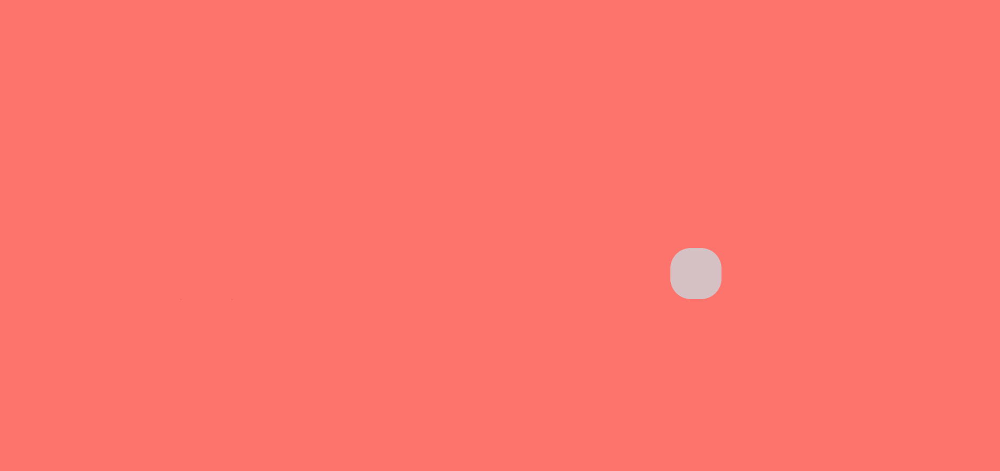

# Pure CSS Styles

## Blend


<!--more-->

Click to [Style Blend](../zh/test-page.html)

# Anime.js

## Practice - Targets

### CSS Selector


* HTML

```html
<div class="small-block-1"></div>
```

* CSS

```css
div.small-block-1{
  position: absolute;
  left: 22.5vw;
  top: calc(50vh - 2.5vw);
  width: 5vw;
  height: 5vw;
  border: 0rem;
  border-radius: 1vw;
  background-color: #2c3e50;
}
```

* Javascript

```js
var animation = anime({
  targets: ['.small-block-1'],
  translateX: '50vw',
  loop: true
});
```

Click to [ANIME WITH CSS SELECTOR](../zh/anime01-css-selector.html)

### DOM List Selector


> DOM Node

```js
targets: el.querySelector('.item')
```

> Node List

```js
targets: el.querySelectorAll('.item')
```

* HTML

```html
<div class="small-block a"></div>
<div class="small-block b"></div>
<div class="small-block c"></div>
```

* CSS

```css
.small-block{
  position: absolute;
  left: 22.5vw;
  width: 5vw;
  height: 5vw;
  border: 0rem;
  border-radius: 1vw;
  background-color: #2c3e50;
}

.a {
  top: calc(50vh - 2.5vw - 6vw);
}

.b {
  top: calc(50vh - 2.5vw);
}

.c {
  top: calc(50vh - 2.5vw + 6vw);
}
```

* Javascript

```js
var elements = document.querySelectorAll('.small-block');
var animation = anime({
  targets: elements,
  translateX: '50vw',
  loop: true
});
```

Click to [ANIME WITH DOM SELECTOR](../zh/anime02-dom-selector.html)

### Javascript Object


* HTML

```html
<div class="main">
  <p class="battery-log"></p>
</div>
```

* CSS

```css
.main {
  position: relative;
  justify-content: center;
  width: auto;
  height: auto;
  text-align: center;
  left: 50vw;
  top: 50vh;
}

.battery-log {
  font-size: 2rem;
  color: #2c3e50;
}
```

* Javascript

```js
var logEL = document.querySelector('.battery-log');

var battery = {
  charged: '0%',
  cycles: 120   
}

var animation = anime({
  targets: battery,
  charged: '100%',
  cycles: 130,
  round: 1,
  loop: true,
  easing: 'linear',
  update: function(){
    logEL.innerHTML = JSON.stringify(battery);
  }
});
```

Click to [ANIME WITH JAVSCRIPT OBJECT](../zh/anime03-js-selector.html)

## Practice - Proporties

### CSS Proporties

> Most CSS properties will cause layout changes or repaint, and will result in choppy animation. Prioritize opacity and CSS transforms as much as possible.



* HTML

```html
<div class="main"></div>
```

* CSS

```css
.main {
  position: relative;
  justify-content: center;
  text-align: center;
  left: 20vw;
  top: 50vh;
  width: 5vw;
  height: 5vw;
  border: 0rem;
  background-color: #2c3e50;
}
```

* Javascript

```js
anime({
  targets: '.main',
  translateX: ['0', '60vw'],
  // start from the original position to 60vw right of the original
  backgroundColor: '#fee3e1',
  borderRadius: ['0%', '50%'],
  easing: 'easeInOutQuad',
 loop: true
});
```

Click to [ANIME WITH CSS PROPORTIES](../zh/anime04-css-proporties.html)

### CSS Transforms & DOM Attributes


* HTML

```html
<div class="main">
  <div class="transform" id="translate"></div>
  <p>translateX:&nbsp;'60vw'</p>
  <div class="transform" id="translatescale"></div>
  <p>translateX:&nbsp;'60vw'</p>
  <p>scaleY:&nbsp;2</p>
  <div class="transform" id="translateskew"></div>
  <p>translateX:&nbsp;'60vw'</p>
  <p>skewY:&nbsp;30&nbsp;(default:&nbsp;deg)</p>
  <div class="transform" id="translaterotate"></div>
  <p>translateX:&nbsp;'60vw'</p>
  <p>rotate:&nbsp;'1turn'&nbsp;(default:&nbsp;deg)</p>
  <div class="transform" id="perspective"></div>
  <p>perspective:&nbsp;20&nbsp;(default:&nbsp;px)</p>
</div>

<div class="domattributes" id="domblock">
  <input class="input" value="0">
</div>
```

* CSS

```css
.main {
  position: relative;
  left: 20vw;
  top: 5vh;
  justify-content: center;
  text-align: left;
  color: #2c3e50;
}

.transform {
  position: relative;
  left: 0;
  top: 0;
  width: 3rem;
  height: 3rem;
  border: 0rem;
  background-color: #2c3e50;
}

p {
  position: relative;
  left: 0;
}

.domattributes {
  position: relative;
  position: relative;
  left: 20vw;
  top: 5vh;
  justify-content: center;
}

.input {
  position: relative;
  left: 30vw;
  top: 5vh;
  width: 30vw;
  height: 4vh;
  background-color: transparent;
  border-top-color: #2c3e50;
  border-top-width: 1px;
  border-bottom-color: #2c3e50;
  border-bottom-width: 1px;
  border-left-color: #2c3e50;
  border-left-width: 1px;
  border-right-color: #2c3e50;
  border-right-width: 1px;
  text-align: center;
  font-size: 3vh;
  color: #2c3e50;
}
```

* Javascript

```js
<script class="anime">
  anime({
    targets: document.querySelector('#translate'),
    translateX: '60vw',
    easing: 'easeOutElastic(1, 0.5)',
    duration: 2000,
    loop: true
  });
</script> 

<script class="anime">
  anime({
    targets: document.querySelector('#translatescale'),
    translateX: '60vw',
    scaleY: 2,
    easing: 'easeOutElastic(1, 0.5)',
    duration: 2000,
    loop: true
  })
</script>

<script class="anime">
  anime({
    targets: document.querySelector('#translateskew'),
    translateX: '60vw',
    skewY: 30,
    easing: 'easeOutElastic(1, 0.5)',
    duration: 2000,
    loop: true
  })
</script>

<script class="anime">
  anime({
    targets: document.querySelector('#translaterotate'),
    translateX: '60vw',
    rotate: '1turn',
    easing: 'easeOutElastic(1, 0.5)',
    duration: 2000,
    loop: true
  })
</script>

<script class="anime">
  anime({
    targets: document.querySelector('#perspective'),
    perspective: 100,
    easing: 'easeOutElastic(1, 0.5)',
    duration: 2000,
    loop: true
  })
</script>

<script class="anime">
  anime({
    targets: document.querySelector('.input'),
    value: [1,1000],
    easing: 'linear',
    duration: 2000,
    round: 1,
    loop: true
  })
</script>
```

Click to [ANIME WITH CSS TRANSFORMS](../zh/anime05-css-transforms.html)

### SVG Attributes

Click to [ANIME WITH SVG ATTRIBUTES](../zh/anime07-svg-attributes.html) (Currently unfinished)

## Practice - Property Parameters


* HTML

```html
<div class="main">
  <p class="title">Duration</p>
  <p class="info">duration:&nbsp;1000</p>
  <div class="duration"></div>
  <p class="info">duration:&nbsp;2000</p>
  <div class="duration"></div>

  <p class="title">Delay</p>
  <p class="info">delay:&nbsp;1000</p>
  <div class="delay"></div>
  <p class="info">delay:&nbsp;2000</p>
  <div class="delay"></div>

  <p class="title">End Delay</p>
  <p class="info">end&nbsp;delay:&nbsp;1000</p>
  <div class="end-delay" id="enddelaya"></div>
  <p class="info">end&nbsp;delay:&nbsp;2000</p>
  <div class="end-delay" id="enddelayb"></div>

  <p class="title">Round</p>
  <p class="info">round:&nbsp;1000</p>
  <pre class="round" id="rounda"></pre>
  <p class="info">round:&nbsp;2000</p>
  <pre class="round" id="roundb"></pre>

  <p class="title">Specific&nbsp;Property&nbsp;Parameters</p>
  <div class="specific"></div>

</div>
```

* CSS

```css
.main {
  position: relative;
  left: 20vw;
  top: 5vh;
  justify-content: center;
  text-align: left;
  color: #2c3e50;
}

.duration, .delay, .end-delay, .specific {
  position: relative;
  left: 0;
  top: 0;
  width: 2rem;
  height: 2rem;
  border: 0rem;
  background-color: #2c3e50;
}

.round {
  position: relative;
  left: 0;
  right: 0;
  color: #2c3e50;
  font-size: 1rem;
  text-align: center;
  left: 30vw;
}

.title {
  position: relative;
  left: 0;
  font-size: 1rem;
  font-weight: 400;
}

.info {
  position: relative;
  left: 0;
  font-size: 0.9rem;
  font-weight: 200;
}
```

### Duration + Function Based Parameters

* Javascript

```js
<script class="anime">
  anime({
    targets: '.duration',
    translateX: '60vw',
    duration: function(el, i){
      return (i + 1) * 1000;
    },
    loop: true
  });
</script>
```

### Delay + Function Based Parameters

* Javascript

```js
<script class="anime">
  anime({
    targets: '.delay',
    translateX: '60vw',
    delay: function(el, i){
      return (i + 1) * 1000;
    },
    loop: true
  });
</script>
```

### End Delay

* Javascript

```js
<script class="anime">
  animationa = anime({
    targets: document.querySelector('#enddelaya'),
    translateX: '60vw',
    endDelay: 1000,
    direction: 'alternate',
    loop: true
  });
  animationb = anime({
    targets: document.querySelector('#enddelayb'),
    translateX: '60vw',
    endDelay: 2000,
    direction: 'alternate',
    loop: true
  });
</script>
```

### Round

* Javascript

```js
<script class="anime">
  animationa = anime({
    targets: document.querySelectorAll('#rounda'),
    innerHTML: [0,100],
    easing: 'linear',
    round: 1,
    loop: true
  })
  animationb = anime({
    targets: document.querySelectorAll('#roundb'),
    innerHTML: [0,100],
    easing: 'linear',
    round: 10,
    loop: true
  })
</script>
```

### Specific Property Parameters

* Javascript

```js
<script class="anime">
  anime({
    targets: '.specific',
    translateX: {
      value: '60vw',
      duration: 800
    },
    rotate: {
      value: 360,
      duration: 1800,
      easing: 'easeInOutSine'
    },
    scale: {
      value: 2,
      duration: 1600,
      delay: 800,
      easing: 'easeInOutQuart'
    },
    delay: 250,
    loop: true
  });
</script>
```

Click to [ANIME WITH PROPERTY PARAMETERS](../zh/anime08-property-parameters.html)

## Practice - SVG

### SVG Line Drawing


* HTML

```html
<div class="main">
  <svg id="图层_1" data-name="图层 1" xmlns="http://www.w3.org/2000/svg" xmlns:xlink="http://www.w3.org/1999/xlink" width="386.32" height="368.69" viewBox="0 0 386.32 368.69">
    <defs>
      <style>.cls-1,.cls-3,.cls-4{fill:none;}.cls-2{clip-path:url(#clip-path);}.cls-3,.cls-4{stroke:#fd746c;}.cls-3{stroke-linecap:round;stroke-linejoin:bevel;stroke-width:2px;}.cls-4{stroke-miterlimit:10;stroke-width:2px;}</style>
      <clipPath id="clip-path" transform="translate(-762.28 -336.79)">
        <path id="SVGID" class="cls-1" d="M1069.68,470.75a111.5,111.5,0,1,0-217.1,8.35,107.52,107.52,0,0,0,3.91,11.73,111.5,111.5,0,0,0,213.19-20.12Z"/>
      </clipPath>
    </defs>
    <title>200207title</title>
    <path fill=none stroke="#fd746c" stroke-width="1px" d="M762.28,687.61l61.21-64.34H765.25V604.06h89.21v19.29l-60,62.93h64.82l-2.74,19.2H762.28Z" transform="translate(-762.28 -336.79)"/>
    <path fill=none stroke="#fd746c" stroke-width="1px" d="M967.89,666.64c0-17.48.13-35.68.7-46.92h-.14c-5,18.74-14.58,48.49-26.52,85.76H920.26c-9.29-32.69-20-66.52-25.33-85.74h-.14c.75,11.79,1.67,31.5,1.67,48.78v37H874.29V604.06h35.57c10.18,31.41,19.54,59,22.56,72.84h.15c4.29-16,13.45-42.64,23.32-72.84h35.72V705.48H967.89Z" transform="translate(-762.28 -336.79)"/>
    <path fill=none stroke="#fd746c" stroke-width="1px" d="M1099.36,662.69h-56.6v23.09h62.93l-2.83,19.7h-84.71V604.06h84.27v19.71h-59.66V643h56.6Z" transform="translate(-762.28 -336.79)"/>
    <path fill=none stroke="#fd746c" stroke-width="1px" d="M1148.6,604.06V705.48H1124V604.06Z" transform="translate(-762.28 -336.79)"/>
    <g id="putline">
      <g class="cls-2">
        <path class="cls-3" d="M783.66,516.33h0c42.64-14.17,67.57-24.64,104-51" transform="translate(-762.28 -336.79)"/>
        <path class="cls-3" d="M1018.66,450.33c41,27.92,73.43,39.52,121.36,52.29" transform="translate(-762.28 -336.79)"/>
        <path class="cls-3" d="M902.94,455.21a437.59,437.59,0,0,0,57.32-49.56" transform="translate(-762.28 -336.79)"/>
        <line class="cls-3" x1="188.14" y1="142.74" x2="243.38" y2="104.37"/>
        <line class="cls-3" x1="197.98" y1="68.86" x2="188.14" y2="142.74"/>
      </g>
      <path class="cls-4" d="M1069.68,470.75a111.5,111.5,0,1,0-217.1,8.35,107.52,107.52,0,0,0,3.91,11.73,111.5,111.5,0,0,0,213.19-20.12Z" transform="translate(-762.28 -336.79)"/>
    </g>
  </svg>
</div>
```

* CSS

```css
.main {
  position: relative;
  left: 20vw;
  top: 5vh;
  justify-content: center;
  text-align: left;
  color: #fd746c;
}

svg {
  position: relative;
  top: 25vh;
  left: 30vw;
}
```

* Javascript

```js
anime({
  targets: 'div svg path, div svg line',
  strokeDashoffset: [anime.setDashoffset, 0],
  easing: 'easeInOutSine',
  duration: 2000,
  delay: function(el, i) { return i * 100 },
  direction: 'alternate',
  loop: true
});
```

Click to [ANIME WITH SVG LINE DRAWING](../zh/anime06-svg-linedrawing.html)

# IMG Before-After

> For test;
> 
> The layout need refurbishing, as well as the convertor.
> 
> For Valentine's Day 2020.


Click to [IMG BEFORE-AFTER](../zh/valentines2020.html)

# Back-To-Top Button


* HTML

```html
<button onclick="topFunction()" id="myBtn" title="Go to top">Top</button>
```

* CSS

```css
html {
  scroll-behavior: smooth;
}

#myBtn {
  display: none;
  position: fixed;
  height: 40px;
  width: 40px;
  bottom: 20px;
  left: 30px;
  z-index: 99;
  border: none;
  outline: none;
  background-color: #fd746c;
  color: #2c3e50;
  cursor: pointer;
  font-size: 10px;
}

#myBtn:hover {
  background-color: #2c3e50;
  color: #fd746c;
  transition-duration: 0.5s;
}
```

* Javascript

```js
<script>
  var mybutton = document.getElementById("myBtn");
  
  window.onscroll = function() {scrollFunction()};
  
  function scrollFunction() {
    if (document.body.scrollTop > 20 || document.documentElement.scrollTop > 20) {
      mybutton.style.display = "block";
    } else {
      mybutton.style.display = "none";
    }
  }
  
  function topFunction() {
    document.body.scrollTop = 0;
    document.documentElement.scrollTop = 0;
  }
</script>
```

Click to [BACK-TO-TOP](../zh/valentines2020.html)