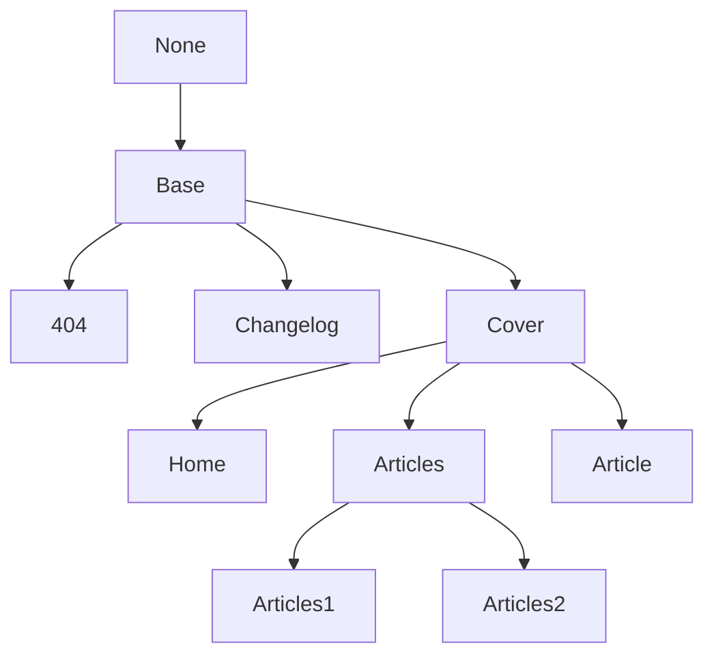

```mermaid
graph TD
None[None] --> Base[Base]
Base[Base] --> 404[404]
Base[Base] --> Changlog[Changelog]
Base[Base] --> Cover[Cover]
Cover[Cover] --> Home[Home]
Cover[Cover] --> Articles[Articles]
Articles[Articles] --> Articles1[Articles1]
Articles[Articles] --> Articles2[Articles2]
Cover[Cover] --> Article[Article]
```

