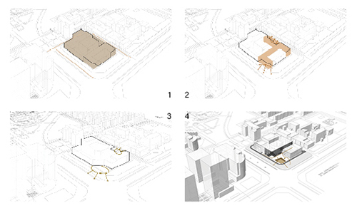
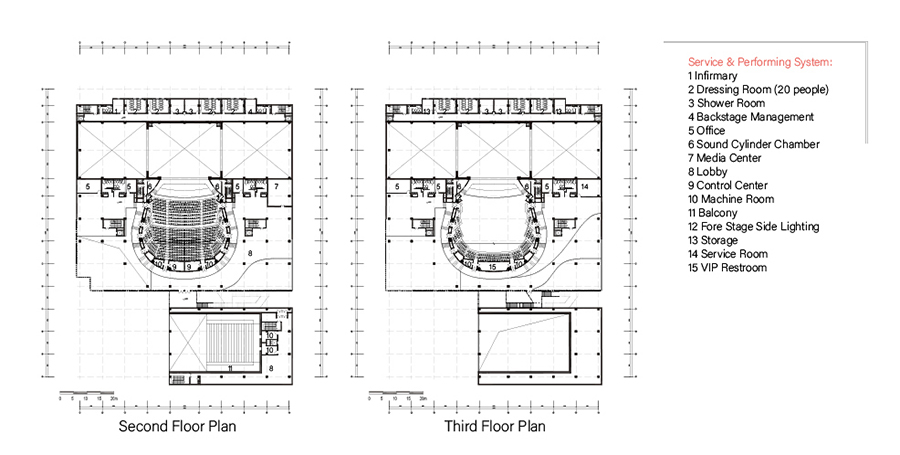

> Modify date: 2020-11-10

# Abstract

The project located in Wudaokou with several schools, IT centers, government offices and malls around. People here only went out of the office at meal and were squeezed onto the road by the massive pedestrians.

In the compact urban space, the project aimed to offer not only a traditional theater, but a system of the open space for everyone's experiecing, exhibition, communication and performing. The activities expand the timeline in which the workers, students and residents use the space.

---

# Basic Info

head1 | head2
--- | ---
Category | Large public building, Individual work 
Location | Beijing, China 
Date of design | Mar 2018 - May 2018 
Tutor | Prof. Lu Xiangdong 
Total area | 25,586 m² 
Site area | 13.591 m² 
Building foor print | 7,400 m² 
Building coverage | 0.54 
Green rate | 14% 
F.A.R | 1.88 
Parking space | 45 onground, 173 underground 
Seat amount | Stalls 769, Balcony 480, Total 1249 
Main stage size | 18 m * 15 m 
Proscenium | 12 m in height, 17.6 m in width 

---

# Conceptual

## Expansion of people's timelines & activities

There are already schools, offices, malls, and residential buildings around, leaving little open space for the citizen. Studying the activity timelines of the residents, office workers and students in the neighborhood, we can learn that most of the activities occur at meal. 

By introducing the elements of culture and art here, the theater contributes to a further diversification of the open space and attracting people come here in different period of a day by the performance and exhibition.

## Developing open space

The main entrance is faced with the main road of South Tsinghua Rd, followed by an alley passing through the building. There are open spaces at both end of the alley, defining the performing and communication space for citizens. Along the alley there is a demensional exhibition space.

---

# Technical Delivery

## Ground floor plan

## Other plans

## Sections

## Sectional model

## Technical analysis

---

# Renders

## The mirrored stage for citizens

The glass wall acts both as the background of the experimental theater and the square. People can perform their own activities on the square while being framed into the scene inside. At the same time, the night sky is contained in the scene on both sides.

---

