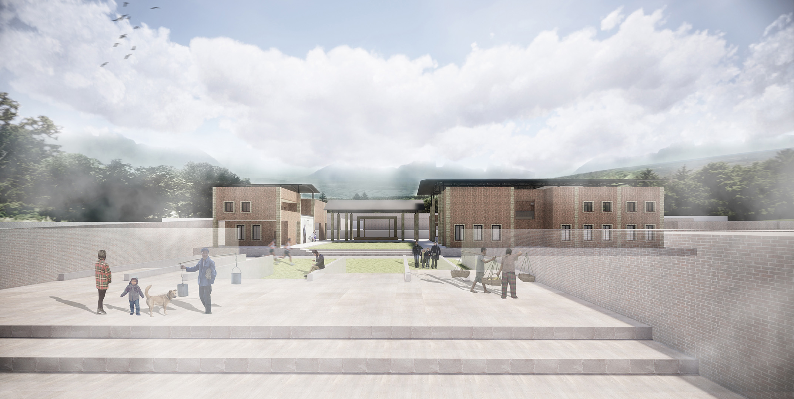
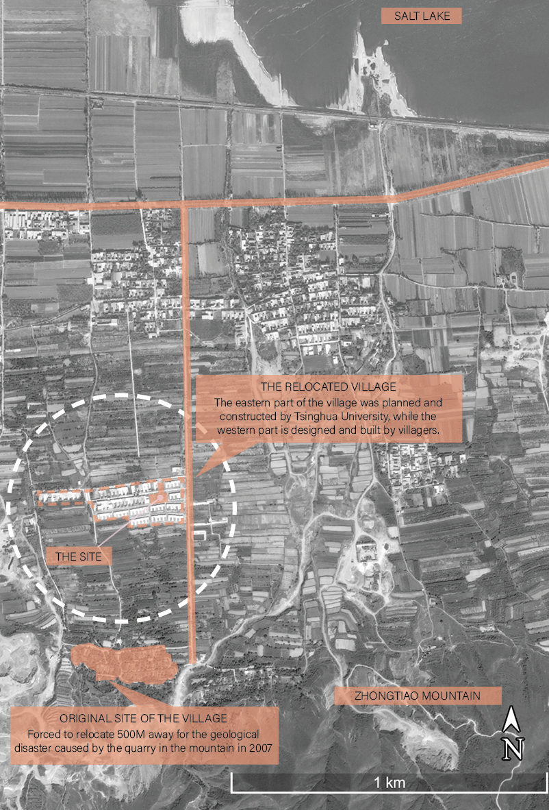
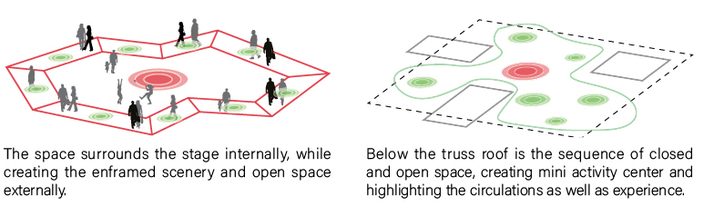
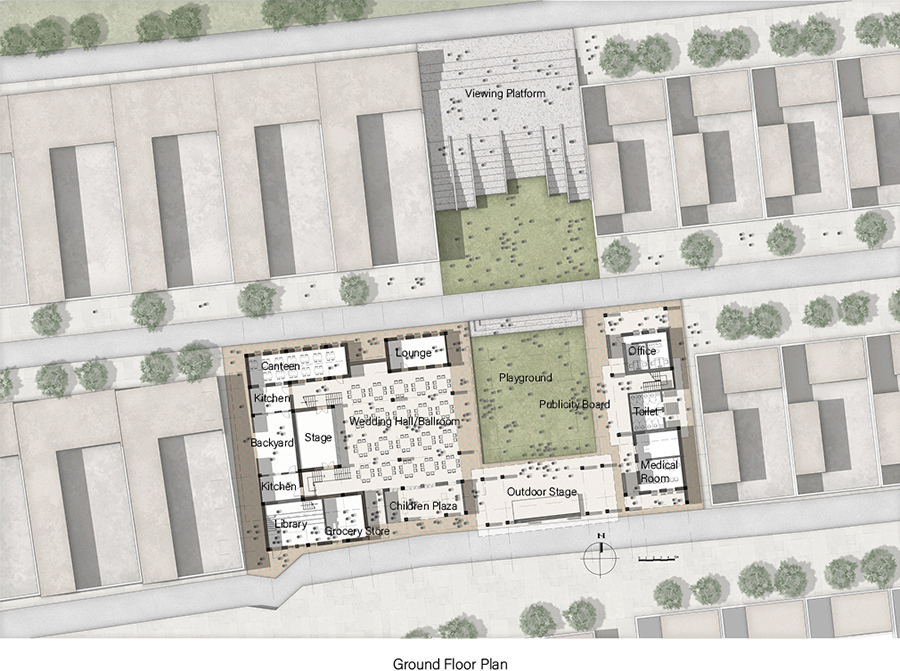
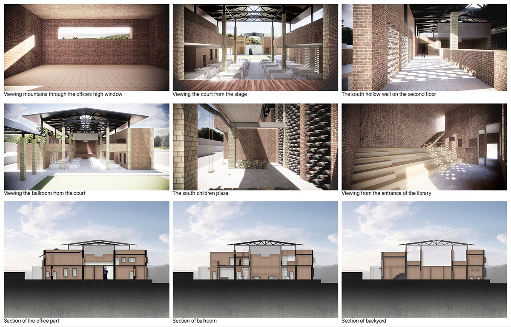
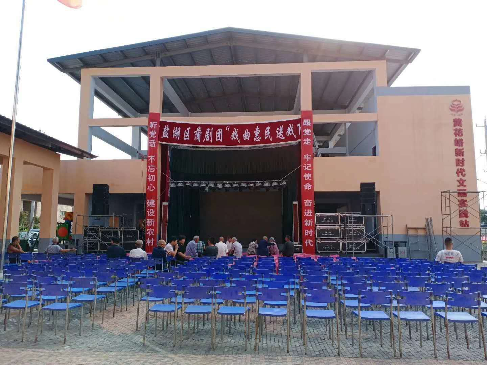

> Modify date: 2020-11-02

# Abstract

The building is used for wedding, meeting and everyday activities for villagers.

The project mainly considered 3 aspects if input conditions.

* The mountain-water axis - The north-south leg of the T-shaped site is used as a corridor through the center, ending with a small stage in the south. Plus, there are viewing platforms on each floor facing south or north.
* The historical conditions - Old tiles, bricks and beams are used to recall the villagers' memories of the live before relocating.
* The open space - There is open space on each floor for both activities and sightseeing.

---

# Basic Info

head1 | head2
--- | ---
Category | Completed project, Villagers' activity center 
Location | Shanxi, China 
Date of design | Aug 2018 - Dec 2018 
Tutor | Prof. Zhuang Weimin 
Collaborator | Dang Yutian 
Size | 2,700 m² 
GFA | 1,200 m² 

---

# Conceptual Design

## Site Understanding

## Dimensions for Activities, Space, Materials & Seasonality

The villagers' center is designed with the comprehensive analysis of activities, materials&technology, and cultural input.

The interactions between each two inputs are taken into consideration. The activities are defined as daily ones and cultural ones according to farming season and traditional festivals, while the materials also include some traditional ones and those from the original village before relocating to create a sense of memorizing and inheritting. Besides, the materials used to construct the space are decided by the demand of different activities.

## Patterns for Spatial Sequence

---

# Schematic Design

## Plans & Structrual Analysis

* The main interior space is a combination of the stage & wedding hall system, the activity&elderly-care system, and the office&meeting system.
* The outdoor space is an association of viewing platform and several playgrounds, offering space with scenery from both north and south.
* There is an axis formed by the playgrounds, connecting the sight from the mountains and the lake.
* The walls are constructed with local bricks made of Loess, followed by ring beam on the top, considering the local conditions.

## Details

---

# Construction

---