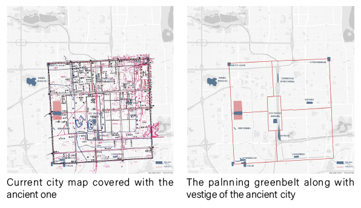
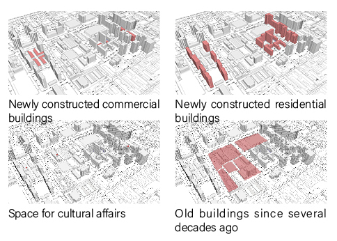
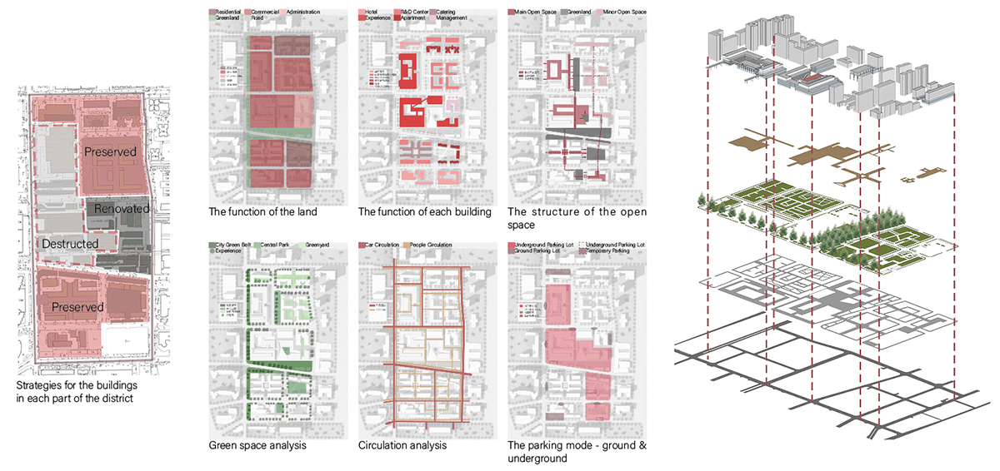
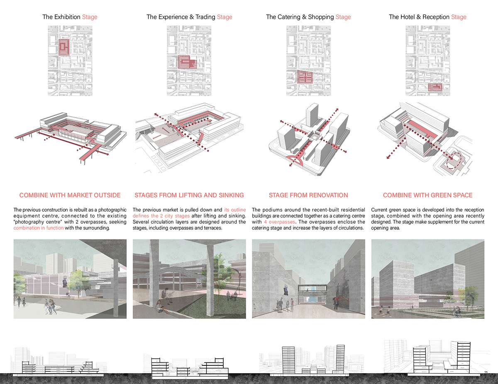

> Modify date: 2020-11-02

# Abstract

Up to the scale of the city of Beijing, a city greenbelt is designed to connect the vestige of the capital of Jin Dynasty.

The green space in the site is defined by the historical vestige of the captital of Jin Dynasty.

The newly constructed buildings serve as the stage for citizen, compensating the shortcoming of the life online.

New buildings make connections in form with the surrounding ones built in different years.

---

# Basic Info

head1 | head2
--- | ---
Category | Individual professional work, Integration of cultrual & industrial hestige 
Location | Beijing, China 
Date of design | Sep 2017 - Nov 2017 
Tutor | Prof. Huang He 
Size | 30,100 m² 
Current building area | 568,331 m² 
Renovated building area | 27,286 m² 
Destructed building area | 81,149 m² 
Constructed building area | 130,947 m² 
Green rate | 48% 
Floor area ratio | 2.05 
Parking space | 3,200 

---

# Design Inputs

## A. Historic Inputs

### Profound Insight of the History

Beijing was first constructed as the capital of China in *Jin Dynasty* (1115-1234A.D.), and at that time it was called *“Jin Zhongdu”*. Now we witness the magnificence *the Forbidden City*, while the vestige of *“Jin Zhongdu”* is hard to find.

As I covered the map today with the ancient one, I found the site is right on where one of the capital gates used to be. I found several vestige along the outer and inner city wall as well as the two main roads in the city.

So, I tried to design a city greenbelt, connecting each vestige one by one, to symbolize the existence of the earlist capital in Beijing. Where the belt goes through the site will be a cultural park.

However, have the existing urban land been fully developed and utilized?

When space so-called left for landscape is transformed into an urban area with a specific density, will the city be more active?

What kind of relationships should be developed between buildings? 
What kind of synergy can be formed? 
Can we build organic and smart cities, neighborhoods, and homes?

Based on these thinkings, the topic is focused on the existing urban space - the space between the main entrance and administrative building in Tsinghua.

### Building History & Classification

Maliandao Rd used to be the China’s largest tea market since 1950’s, serving as a trading place, a distributing centre and a price-set centre. There have been mostly simply built warehouses.

However, as the government of Beijing is re-organizing the industries, the site is being transformed into a commercial space with a minor amount of residential space, thus the site is a mixture of warehouses, one-story house, office buildings and large markets.

At this point, I am supposed to determine which part in the site is to be destructed and which to be renovated. And in the next step, I will define the role the site plays in the surrounding area.

## B. Incentives Large Scale and Modern Economy

### What Citizen Need around Neighborhoods?

**City Complex?** The so-called city complex is proved not successful everywhere, and among the ones surrounding the site, there are several districts with bad management and about to shut down.

There have been supermarkets across Maliandao Road, and the online lifestyle is eroding people’s willingness to go to shopping malls and restuarants. So, how to drag the customers into the site?

**All we need is a stage for citizen.** People cannot appreciate the artworks and exhibitions of workmanships online. Neither can they experience practising, communicating, colliding and fusing. Here is the point where we need a city stage.

### What to be on Stage After the Renovation?

The site is a mixture of historical vestige, early transportation buildings and the culture of tea.

The stage is mainly for the youth.

The first one can be shown through exhibition and documentary on stage and in the cultral park according to the city’s greenbelt.

The stage is designed according to the outline of an old warehouse.

The young can drink tea with friends and learn the process in tea-making on city stage. Shop owners can show their workmanships on stage.

---

# Design Stages

## Structures

## Site Plan

## Detailed Design for Each Stage

---