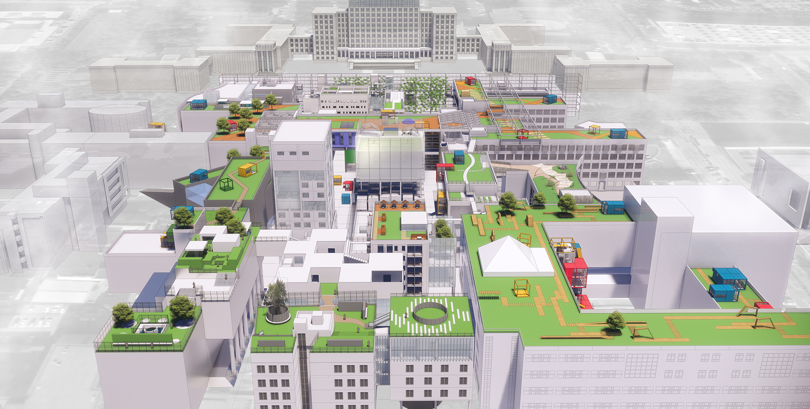
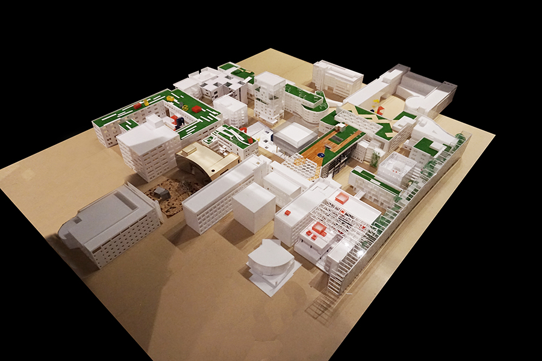
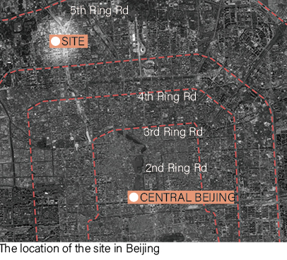
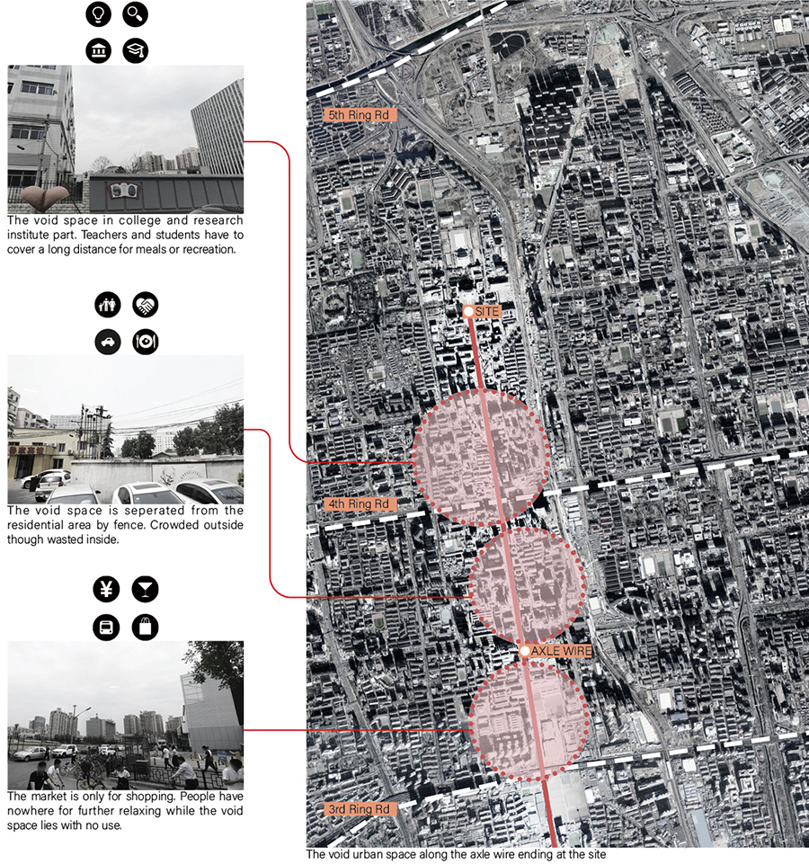
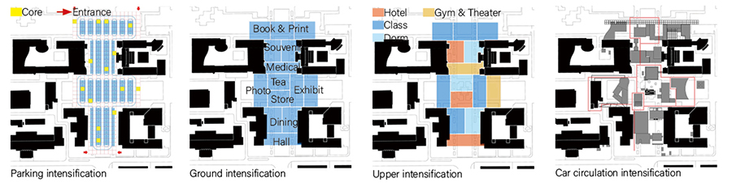
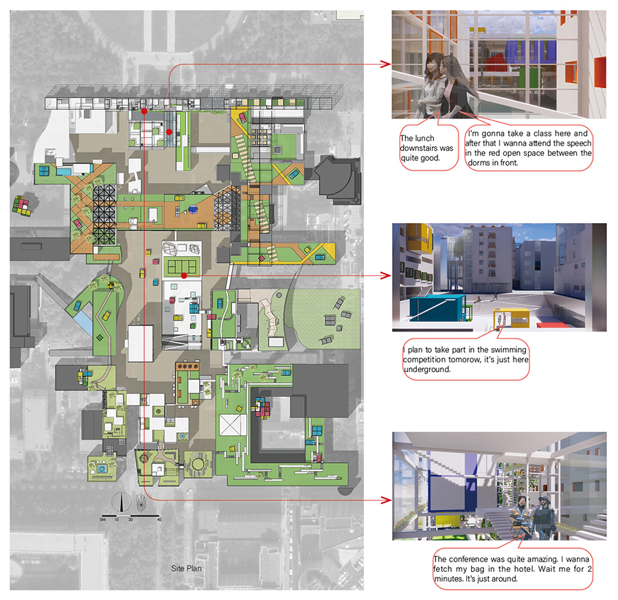
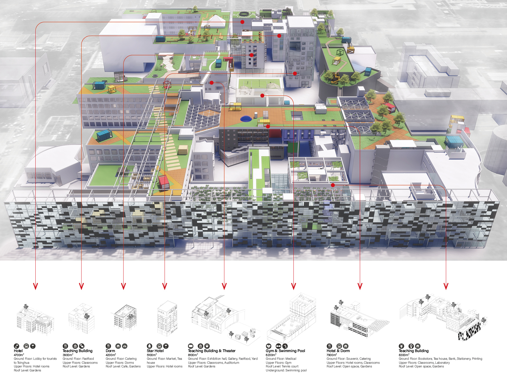

> Modify date: 2020-02-13

# Abstract

The project is located on the void space between the entrance and administrative building at Tsinghua, aimed to intensify the functions here and to explore the relationships among each building, activating the space, inviting people onto the site, and offering daily service for students, tourists, and professors.

<!--more-->

* Parking Intensification - Solve the parking problems. Professors can park right underground the teaching buildings.

* Circulation Intensification - Allow cars and people into the site, which used to be separated for landscapes. More space experiencing with denser circulations.

* Functional Intensification - Introduce daily service on the first floor. Add space for class, hotel, and recreation.

* The Relationships Intensification - Connect the new buildings with the existing ones with roof gardens and ground yards.

---

# Basic Info

head1 | head2
--- | ---
Category | Professional work of urban design
Location | Tsinghua, Beijing, China
Date of design | Feb 2017 - Apr 2017
Tutor | Prof. Qi Xin
Collaborator | Wen Qiulin, Lei Yuxin, Jiang Haomao and other 10 students
Total GFA | 73,000 m²
Site area | 27,000 m²
Green rate | 34%
Floor area ratio | 2.74

---

# Design Stages

## The Intensification In Built Site

The urban space is continually expanding over the years, with the distance growing, the resources being depleted and the pollution worsening.

However, have the existing urban land been fully developed and utilized?

When space so-called left for landscape is transformed into an urban area with a specific density, will the city be more active?

What kind of relationships should be developed between buildings? 
What kind of synergy can be formed? 
Can we build organic and smart cities, neighborhoods, and homes?

Based on these thinkings, the topic is focused on the existing urban space - the space between the main entrance and administrative building in Tsinghua.

## Layout And Scenarios

## Programs

---

