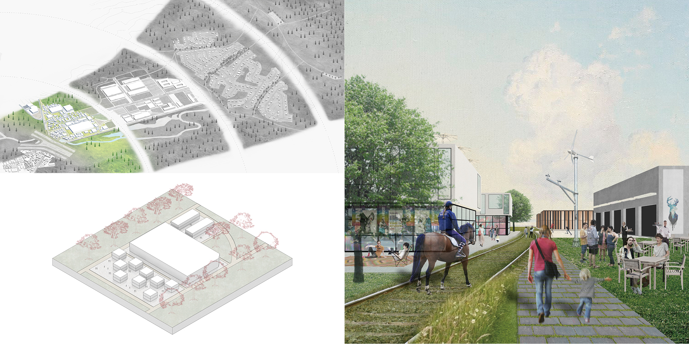
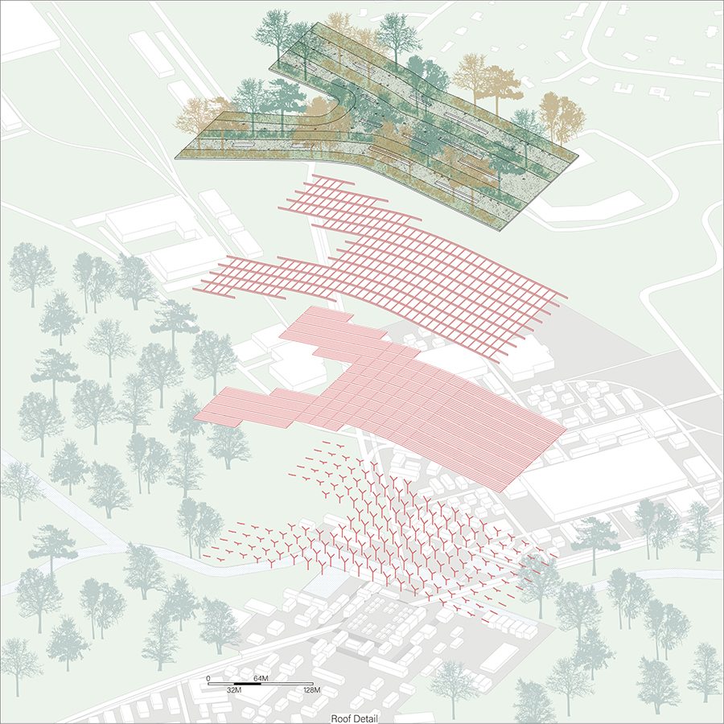

> Modify date: 2020-01-28

# Abstract

The campus focused on outdoor gear industry, which is one of the largest economic sectors in the states. The site and neighbor form an attractive leisure landscape thanks to the combination of the natural resource and its strong transportation infrastructure.

<!--more-->

The campus acted as a catalyst for reconfiguration of the surrounding suburban landscape by overlaying green infrastructure and concentrated campus core.

There are two frameworks in the suburban environment:

* The relation/isolation between the nature and the developed built environment;

* An overdriven rationality about life, work and leisure.

---

# Basic Info

head1 | head2
--- | ---
Category | Professional work of urban design
Location | Westwood, MA
Date of design | Oct 2019 - Dec 2019
Tutor | Peter Rowe, Yun Fu
Collaborator | Yuki Takata

---

# Design Stages

## Conceptual Design

> Strategy of Concentration and Reaching-out

Potentially there are three office campuses including the original site.

Instead of thinking them separately, we decided to treat three campuses as a larger compound.

The compund forms a three-leaf-clover shape, each leaf of which functions together within three concentric circles with different characters.

## Understanding Suburban

> Two Frameworks in the Suburban Environment

* One perspective is the relation/isolation between the nature and the developed built environment. Typically, the greenery behaves as an untouchable “sea” and it divides and isolates suburban city “islands” each other barely connected with infrastructural bridges.

* The other is an overdriven rationality about life, work and leisure. The ideal lifestyle once modernists dreamed has somehow realized with nostalgic flavor and cut-and-paste.

To overcome the homogeneity, we superimposed concentric green onto city center and redefined the suburban landscape as more coherent diversified livelihood with more organically linked relation between housing, office and recreational beyond functional separation.

## Developing Scenarios

### Area I

> Shared Campus Center

The shared campus center made by dense but lower and smaller grains. It is all mixed-use including office, retail and housing. Green walkway and small public spaces are interwoven.

### Area II

> Body Of Campus With Test Fields

The Body of the campus is composed of relatively larger buildings by conserving the existing buildings. This zone also has various kinds of alpha test fields for research and development of outdoor gear.

### Area III

> Factory With Experimental Fields

Surrounding the body of the campus is the factory area with experimental fields, serving as manufacture center and provide space for outdoor gear industry at the same time.

### Area IV

> Bike Lane Connecting Neighbor

A green bike lane reached out residential neighbor, which enables workers to commute 20-minute bike ride. At the end the lane is connected to the existing hiking trail and other surrounding natural resource.

## Detail Design

> The Core And The Eco-Link

The campus visualizes its concept with a symbolic green bridge across the campus core and the roofed bazaar-like plaza. The eco-link from West to East connecting the two parts of green area provides possible paths for wild animals.

Here the enormous economic activity recovers the ecological connectivity, and the active intervention by the developing force provides the possibility of more sustainable reservation of the nature.

The all possible suburban infrastructure such as river, car, train, energy lines and the greenery are vertically accumulated into one concentrated area. In-between the interwoven campus core, people and animals will meet the alternative suburbia.

---