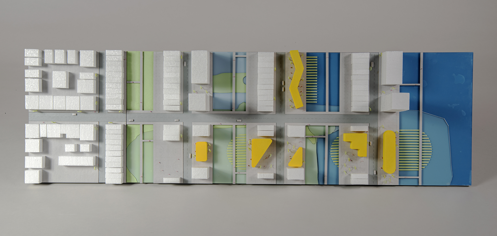
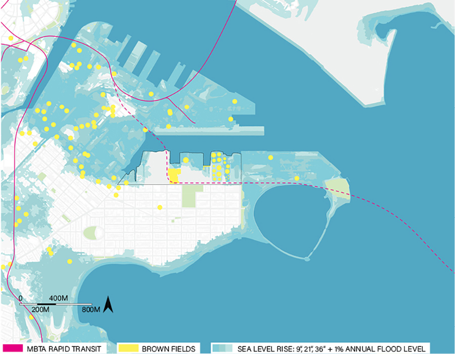
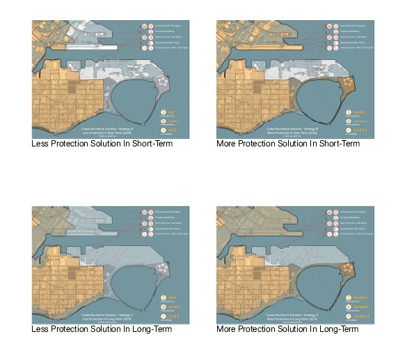
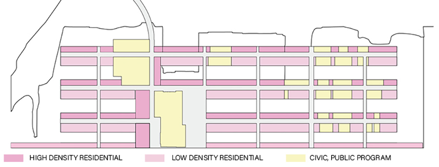
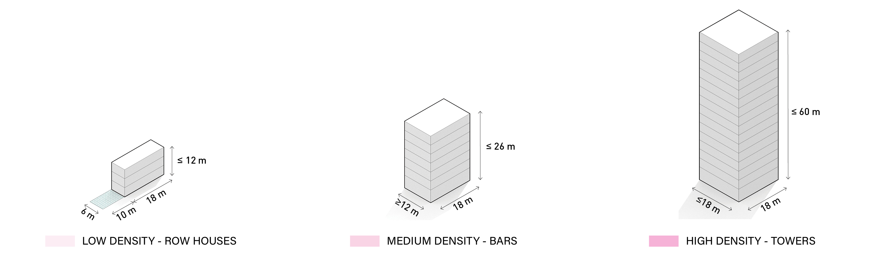
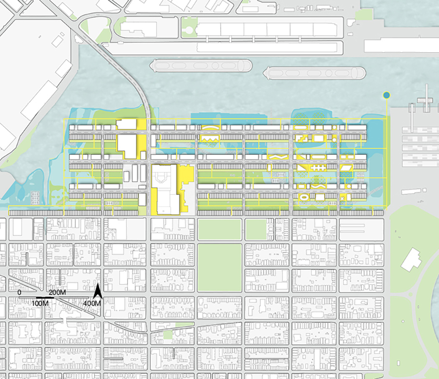
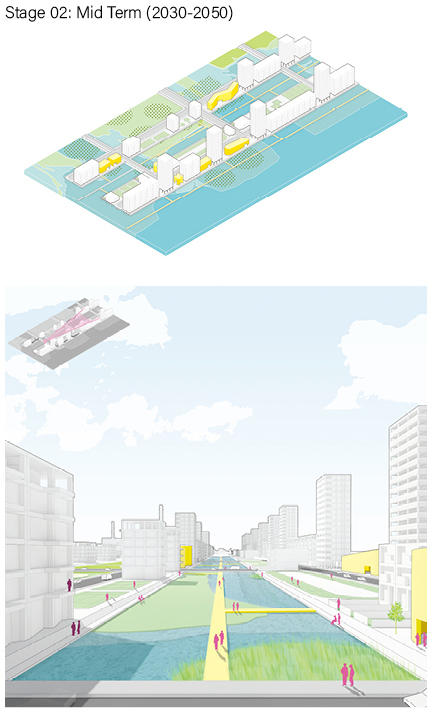
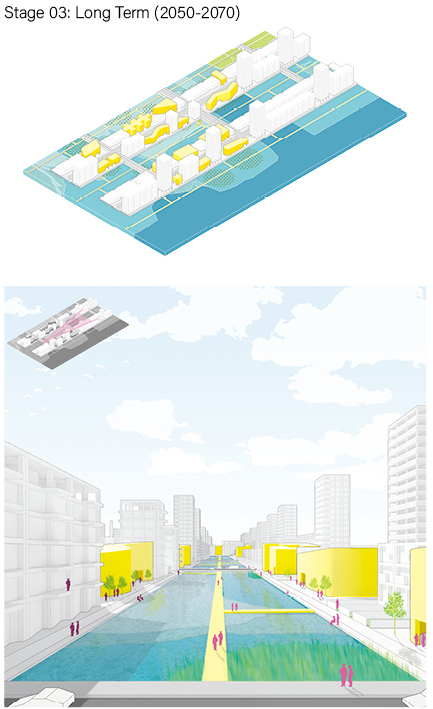
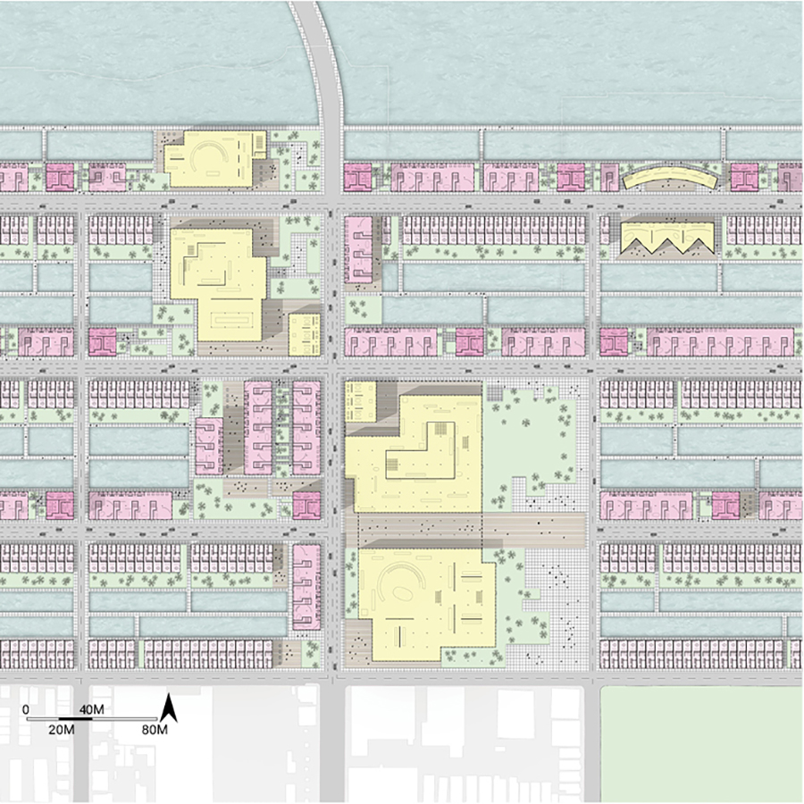
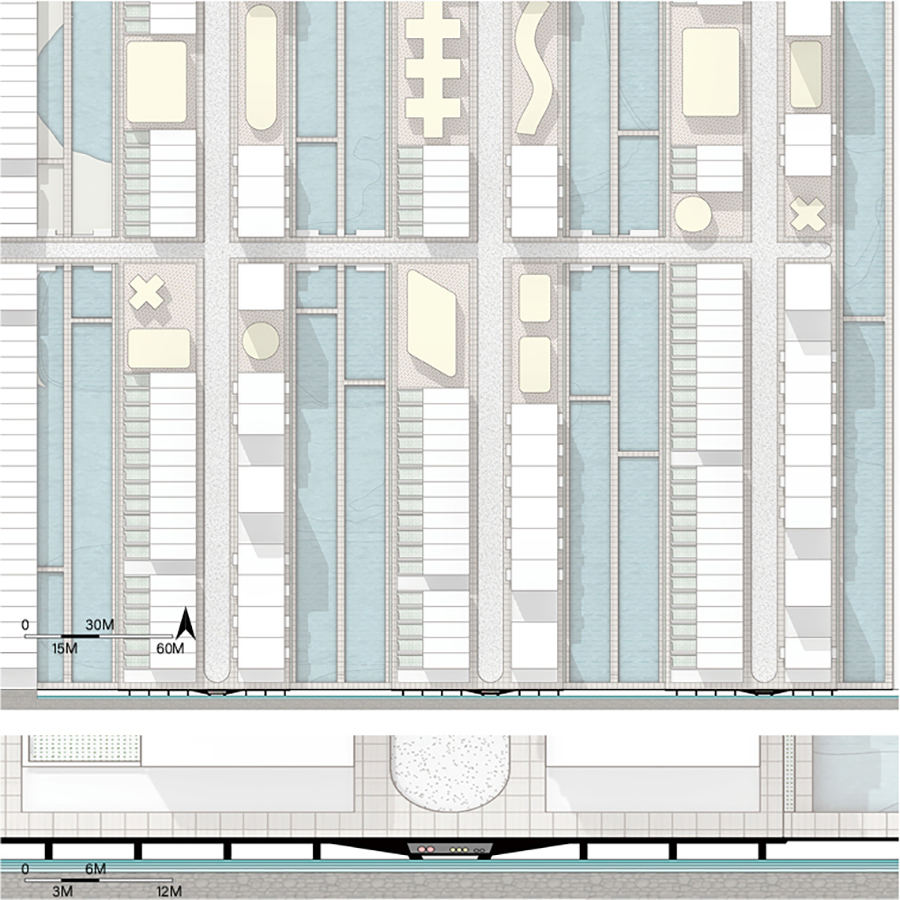

> Modify date: 2020-01-26

# Abstract

* The project is an extension of the existing grid and transportation system, which overrides the mostly underwater site in the future.

<!--more-->

* It deals with the risks of rising sea level and annual flood by chronological design in the short-medium-long term.

* It contains a mixture of three house types from the local, which are arranged according to the site condition facing the risks of rising sea level and annual flood chronologically.

* The housing buildings show a transition in demography from the South Boston neighborhood to downtown Boston.

* Public buildings are proposed and reserved according to the distribution of existing brownfields, which also contains the progressive design with the brownfields being treated gradually.

---

# Basic Info

head1 | head2
--- | ---
Category | Professional work of urban design
Location | South Boston, MA
Date of design | Sep 2019 - Oct 2019
Tutor | Peter Rowe, Yun Fu
Collaborator | Cadence Bayley
Size | 0.5 km², around 4,300 households

---

# Design Stages

## Risk And Potential

Like other areas in Boston, the site faces the risks of rising sea level and annual flood. By the year 2070, half of the site will be submerged. Besides, there are some industry relics on the site, including the brownfields that used to be oil tanks and the power plant.

The project is proposed as an extension of the existing grid in South Boston neighborhood and as the connection to the MBTA transit system.

The road and infrastructure system overrides the flooding area in the future to make room for housing, with the walk lanes going over the water between the housing area.

## Zoning Strategy

> Zoning Strategy Based On Risks Of Sea Level Rise, Concerns On Sunlight, And Treatment Of Brownfields

In the areas facing fewer risks of sea-level rise, the density tends to be higher with more towers in the north row, to make the community more accessible to the marsh parks.

The power plant is partly reserved as the MBTA transit center and the commercial area. On the site of brownfields, there should be public buildings as the brownfields being treated gradually.

## Housing Types & Scenarios

* Row houses with gardens - The low-density houses from the South Boston neighborhood.

* Towers - The high-density houses from downtown Boston.

* Bar buildings - The medium-density houses from downtown Boston.

Basically, in concern with the sunlight, each west-east main district contains two rows of housing buildings - the 3-floor row houses with gardens on the south and the towers or bar buildings on the north.

## Chronological Design

> Chronological Design Of Housing And Progressive Design With The Brownfields

* Short term: Before 2030, there should be the first row of towers and bar buildings in the northernmost end of the site because of the best view to the sea and the easiest access to downtown Boston by cars.

* Mid term: Before 2050, with the brownfields appropriately treated and the sea level rising, swamp parks are developed between the new city grids. With the site connected to the MBTA transit system, more people should move in, and most houses are built to hold the growing population.

* Long term: Before 2070, on the sites of brownfields, there will be public buildings offering service to the community, and the row houses will also be built.

## Detail Design

> Detail Design Of The Core Area Near The Transportation System And The Infrastructure

The power plant is partly reserved and redesigned as the transit center for MBTA, the commercial center of the site, and the outdoor green space. Other industry relics are developed as the library and museum.

The bar buildings around the core area are treated differently, considering the commercial space and landscape.

The infrastructure network goes with the main roads inside the platforms, including electricity, gas, and water.

---

