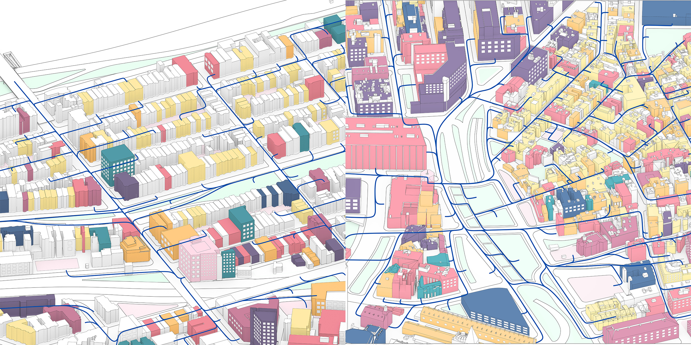
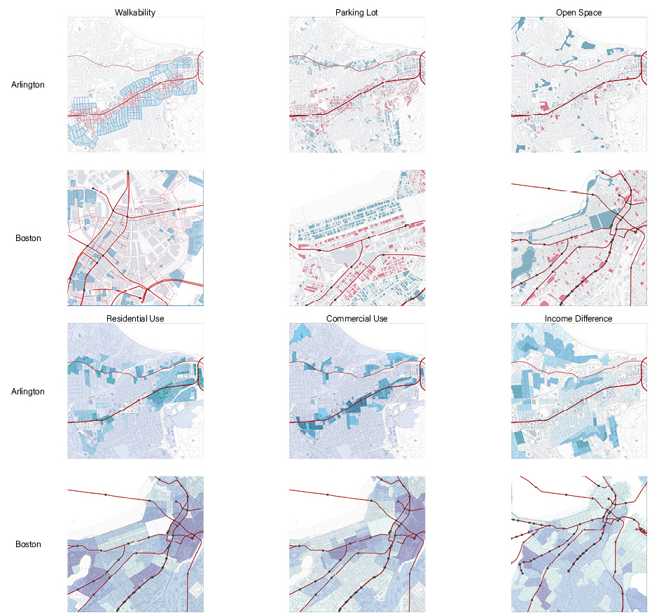
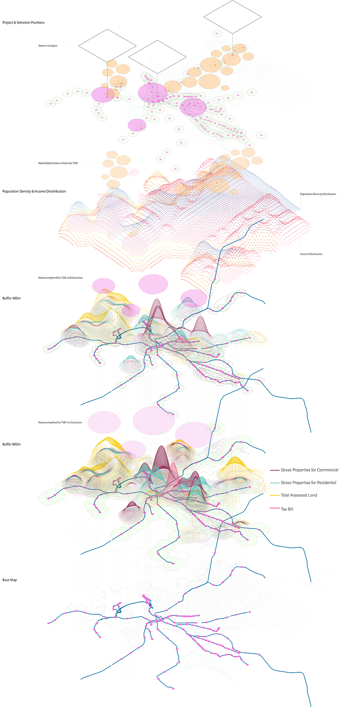
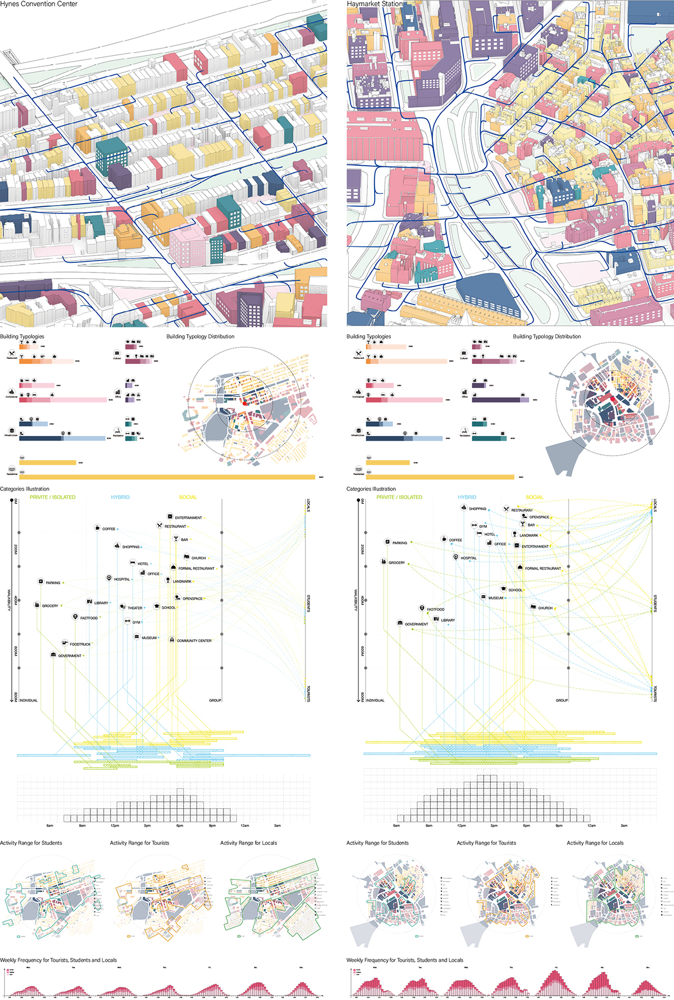

> Modify date: 2020-01-28

# Basic Info

head1 | head2
--- | ---
Category | Research and analysis workshop with GIS
Location | Boston, MA & Arlington, WA
Date of design | Aug 2019
Tutor | Mark Hiller
Collaborator | Yanwei Yang, Jinqi Gu

---

# Part I

> Status Quo Of TOD In Boston (Through comparison & GIS analysis)

* Stage 1: We compared Boston with Arlington, whose TOD system is quite successful. We studied from the points of accessibility, parking, open space, land use, and income difference, to learn where and how the TOD station should be.

* Stage 2: We extracted the points above in with GIS data of Boston to found out which site is the existing TOD and which site needs more.

---

# Part II

> Comparison Of 2 Metro Points' Radiation

We selected two station in Downtown Boston and Backbay respectively to study what a TOD station is like from the building functions, density, distribution, and activities.

---