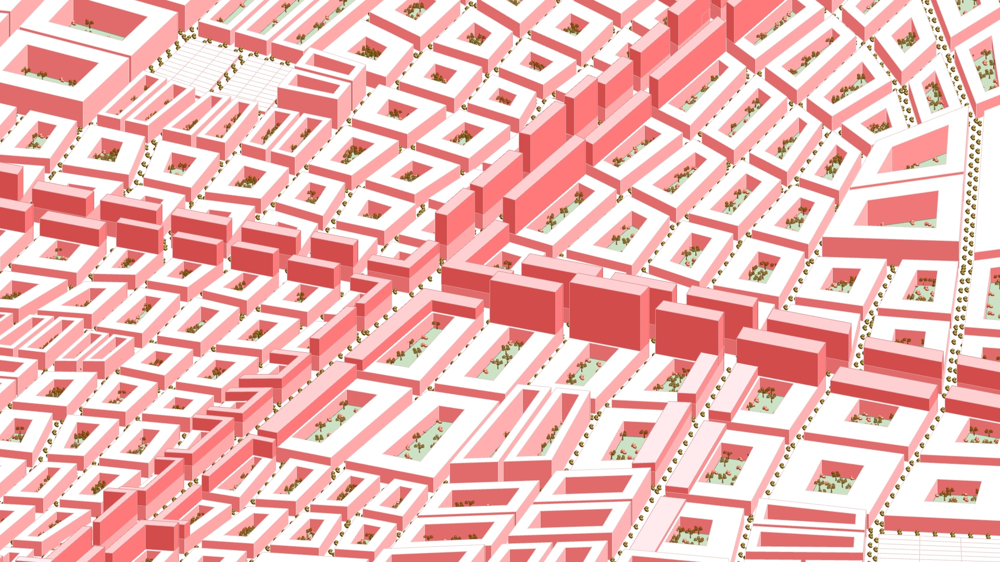
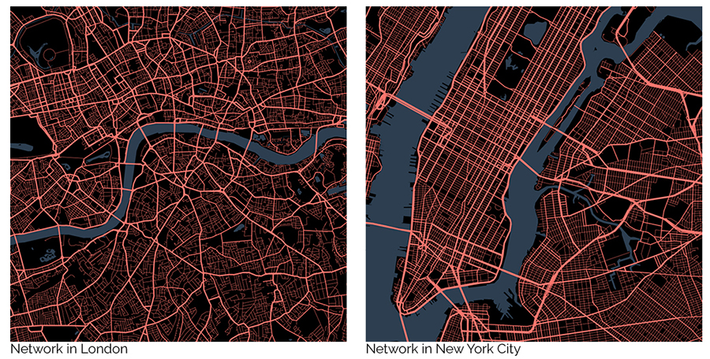
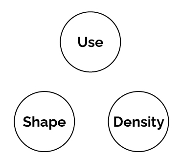
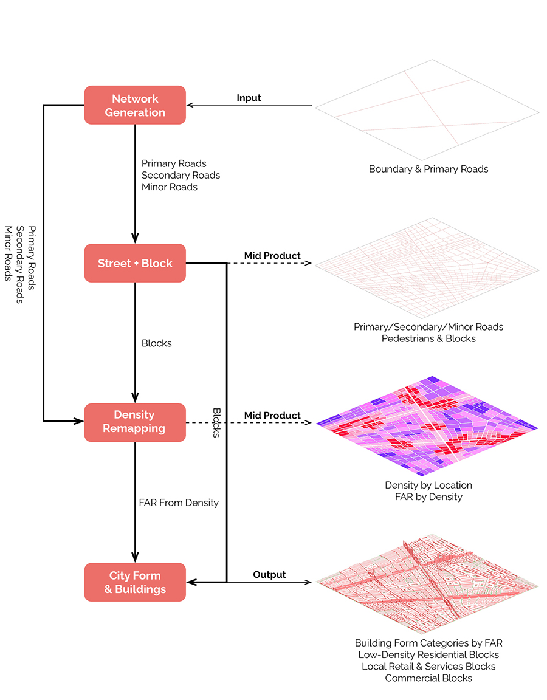
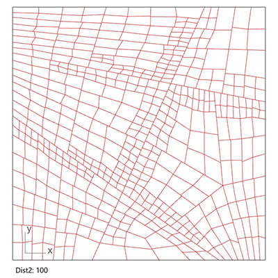
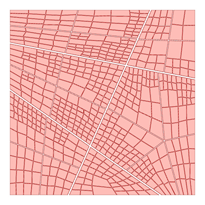
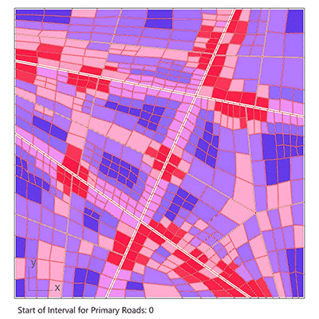
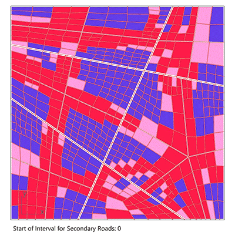
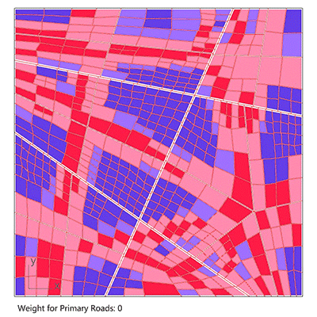
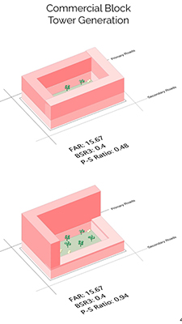

> Modify date: 2021-07-13

# Latest update

The related paper *Cross-Scale and Density-Driven City Generator: Parametric assistance to designers in prototyping stage* is published on [eCAADe 2021](http://www.ecaade2021.ftn.uns.ac.rs/).

View the source codes including `.gh` files and `.cs` files on [Github](https://github.com/saturn-drm/city-generator).

The codes are packed into Grasshopper plugin components and published as [food4Rhino | CITY GENERATOR (by Zihan MEI)](https://www.food4rhino.com/en/app/city-generator).

---

# Basic Info

head1 | head2
--- | ---
Subtitle | Computational Urban Design Tool Kit                          
Category | Professional Work from GSD SCI-6338 Introduction to Computational Design 
Location | GSD, Cambridge 
Date | Nov - Dec, 2020 
Tutor | Jose Luis Garcia del Castillo Lopez 
Collaborator | Pam Pan, Jack Cheng 

The project is written in C# in Grasshopper. It's aimed for:

* Urban designers, to do fast and simple tests with urban structure prototypes
* The public, to explore on the key points that influence the layout and shape of cities

The tool takes in the urban boundary and primary roads and generates the network of roads in 3 classes as well as buildings in various density. It simulates the density variation by scaling blocks and controlling building type and height according to the location block by block.

 
View the project on <a href="https://gsd6338.org/fall2020/projects/city-generator/index.html">course website</a>

 
View the sources on <a href="https://github.com/saturn-drm/city-generator">GitHub</a>

<iframe width="900" height="500" src="https://www.youtube.com/embed/svBy35v-1dQ" frameborder="0" allow="accelerometer; autoplay; clipboard-write; encrypted-media; gyroscope; picture-in-picture" allowfullscreen></iframe>

---

# Introduction

## Organic or Rigid?

Cities around the world have urban forms mainly in 2 tendencies - organic forms like London, and rigid forms like Manhattan. The urban forms determine cities’ overall structure.

In this program, the users can input several primary roads either organic or rigid, and change parameters for secondary and minor roads later, to test the possible outcomes of different urban forms.

## Traditional Zoning Trio

Under each form, cities apply a set of planning rules determining the zoning patterns of themselves. Reviewing the zoning ordinance across the US, the 3 key aspects of traditional zoning are use, shape and density.

This program tries to create the block and building patterns based on the traditional zoning trio. It uses each block’s distance to roads in different classes to define the use and density, which in turn affects the shape of buildings. By playing with parameters, the users are allowed to change the rules by which distance influences the three aspects.

## Roadmap

---

# Part A: Network Generation

## Methodology

Loop over all the blocks and divide those whose area exceeds critical values, until all the blocks cannot be subdivided further.

Generally, being closer to roads of higher class means the block area is smaller, and the road density is higher.

## Demo

* Subdivision Control Group 1: Critical Value 1 (Crt1)

Larger **Crt1** means blocks are larger after division by **secondary roads**.

* Subdivision Control Group 2: Critical Value 2 (Crt2)

Larger **Crt2** means blocks are larger after division by **minor roads**.

* Subdivision Control Group 2: Distance 2 (Dist2)

Larger **Dist2** means even blocks far from **secondary roads** are divided further, while smaller **Dist2** means only blocks near **secondary roads** are subdivided further.

* Subdivision Control Group 2: Amplitude 2 (AmpC2)

Larger **AmpC2** means blocks near **secondary roads** are much smaller than those farther, while smaller **AmpC2** means blocks nearer are similarly large as those farther.

* Random Control Group: Division End Interval (RndPara)

Smaller **RndPara** generates more **rigid** overall structure, while larger **RndPara** generates more **organic** overall structure.

---

# Part B: Street & Block Generation

After the generation of primary/secondary/minor roads, the second step is to offset roads of each class differently, and generate the block setback with pedestrians.

**Input:** Primary/Secondary/Minor Roads

**Parameters:** Width for Primary/Secondary/Minor Roads, Width for Pedestrians

**Output:** Pedestrian Outlines, Building Setback in Blocks

---

# Part C: Density Remapping

Based on the overall structure and general urban forms from Part A, this part prepares for building form generation.

For each block, it classifies the distance to different roads into multiple ranges, and add up the weighted distance to represent the relative density among the blocks. Then it remaps the density to a certain interval of FAR which makes sense for building form generation.

## Demo

* Starting Interval for Primary Roads

Larger starting interval means **primary roads** raise the density of blocks even far away.

* Starting Interval for Secondary Roads

Larger starting interval menas **secondary roads** raise the density of blocks even far away.

* Weight for Primary Roads

Larger weight means **primary roads** raise the density dominantly.

---

# Part D: City Form & Buildings Generation

## FAR

* Floor area ratio
* Generated by Part C
* Determine the density in 3D in reality
* Determine the land use and building shape
  * 0.5 - 2.0: Low-density residential blocks
  * 2.0 - 5.0: Local retail & services blocks
  * 5.0 - 20.0: Commercial blocks

## BSR

* Building space ratio
* Changed by the users
* Determine the density of plan in reality
* Determine basement area and building height given a certain FAR

## P-S Ratio

* Ratio of area of additional towers on the borders closer to primary or secondary roads
* Determine which side of commercial blocks has higher towers

## Demo

* Change BSR for the 3 building forms

* Change P-S ratio

---

# Demos & Screenshots

* Demos

* Script

Click <a target="_blank" href="../../assets/img/00architecture/07citygenerator-6338/cell.png">here</a> to view larger screenshot.

---

