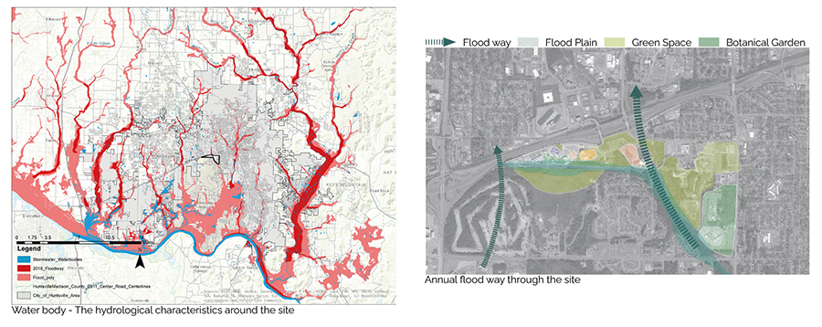
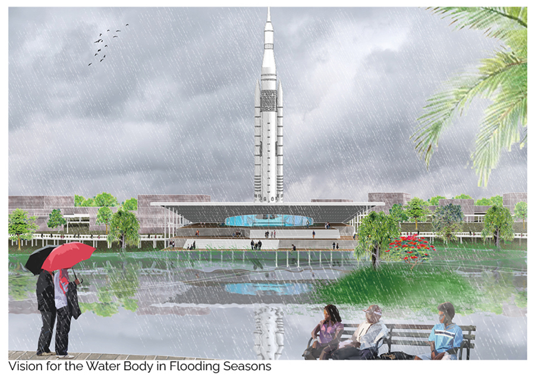
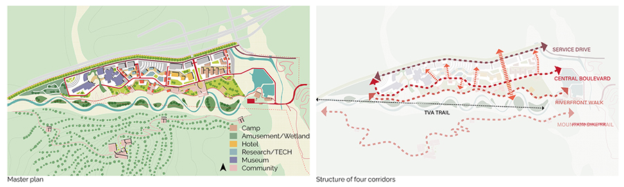
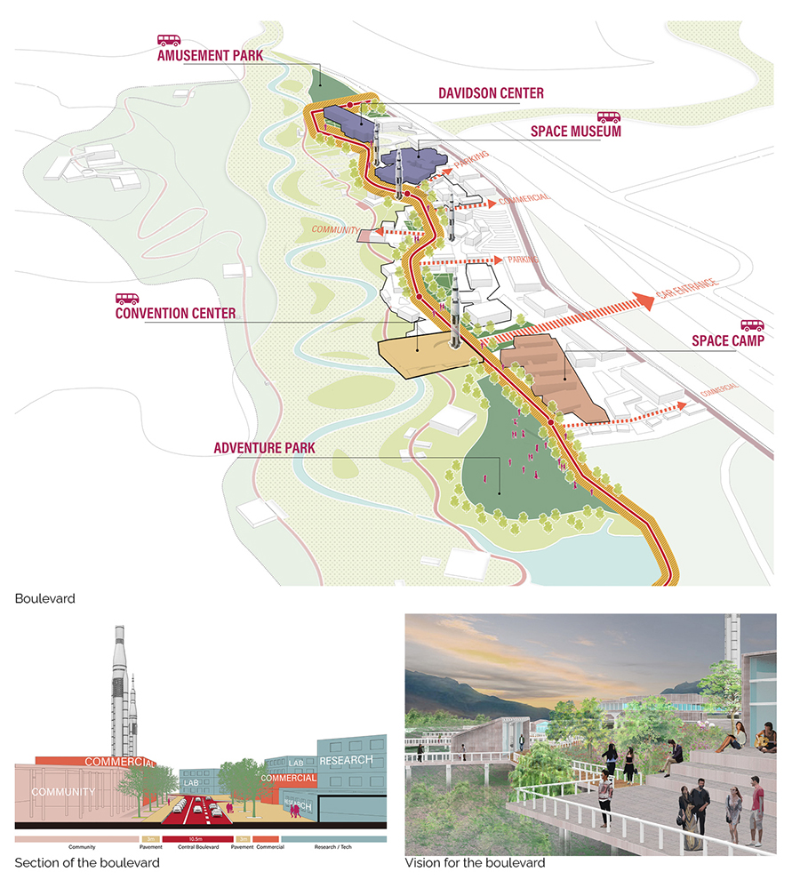
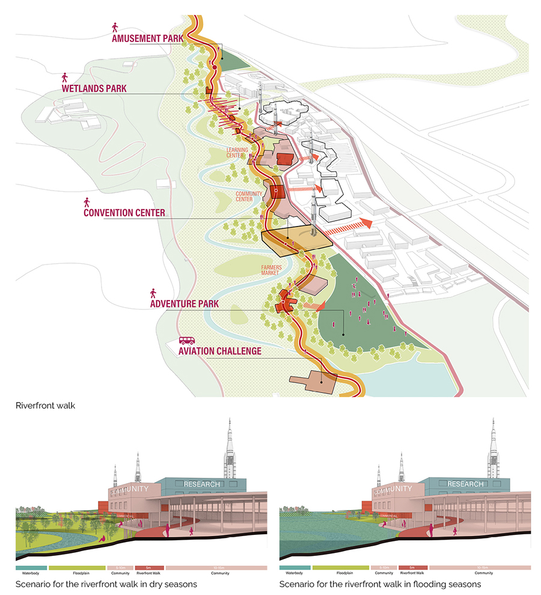
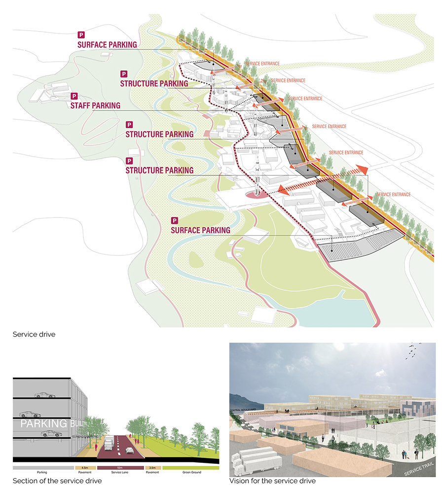
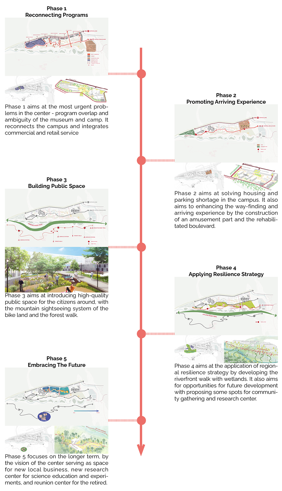

> Modify date: 2021-01-30

# Basic Info

head1 | head2
--- | ---
Subtitle | Urban Design at the U.S. Space & Rocket Center 
Category | Professional Work from MAUD Option Studio 
Location | Huntsville, AL 
Date | Feb - May, 2020 
Tutor | David Gamble 
Collaborator | Angela Zhu 

This is an urban design project for envisioning the future of the U.S. Space & Rocket Center at Huntsville, AL.

The entry point of the project is the hydrological characteristics of the site. The site is modified as a dynamic plan for both flooding and dry seasons. The master plan integrates the site as part of Singing River Trail of the city, and expands the campus along four parallel corridors - mountain bike trail, riverfront walk, central boulevard and service drive. Each corridor addresses various modes of travel and forms part of the phasing plan for the future.

---

# Entry Point

## Flooding Issues

Thirty percent of Alabama is covered in water, making the state the most biologically diverse in the country, and the Tennessee River Valley is laced with over 77,000 miles of rivers and streams. Surrounded by the Cumberland Plateau, Huntsville experiences volatile storms that cause periodical flooding which is exacerbated by a fragmented river system and isolated branches of waterways.

## Flooding Strategy

This Master Plan leverages the presence of the natural and man-made water features on the site to increase water retention areas to address flooding and storm water runoff. The terrain adjacent to the TVA Trail is modified through a cut and fill strategy, growing the water body capacity during the rainy season. The area transitions to managed-meadows during the dry season.

---

# The Four Corridors

## Structure

As opposed to a consolidation strategy, the master plan expands the campus footprint along four parallel east-west corridors that structure the plan.

* The Energy Trail to the south is modified to climb the hillside of Exploration Park and is activated by a series of camp structures for active recreation.
* A re-envisioned Singing River Trail with pavilions for public gathering define the new expanded riverfront.
* At a larger scale, a landscaped boulevard defines the center of the Master Plan, bringing a mixed use zone of commercial uses and learning laboratories as part of a third corridor in closer proximity to the Museum and Space Camp.
* A service drive parallel to the highway that connects surface parking areas forms the northern edge.

Each corridor addresses various modes of travel: biking and running along the trail, strolling for pedestrians along the river walk, driving for visitors along the campus boulevard and access for service near the highway.

## The Boulevard

The boulevard defines the center of the master plan. It connects the main functional pieces, including the relocated camp, proposed convention center, the existing space museum and Davidson Center. It also serves as the drive way for visitors, leading to north-south branches between the functional pieces.

## The Riverfront Walk

The riverfront walk is proposed as part of the Singing River Trail Plan in the city of Huntsville. It serves as a walkway for the residents around as well as the trainees in aviation challenge center. It connects the amusement park and wetlands, and is designed with consideration of resilience for the floodplain.

## The Mountain Bike Trail

The mountain bike trail is proposed on the basis of land transfer between the space center and military base in a longer term. It will serve as the health trail for the residents and those retired from the center, with a nursing home and several service stations along.

## The Service Drive

The service drive is the first corridor from the north. It’s parallel with the highway, and serves as the main entrance from that. It connects the entrances of surface and structure parking. The parking buildings form the north facade of the whole site against the highway and exclude the noise.

---

# The Phasing Strategy

---