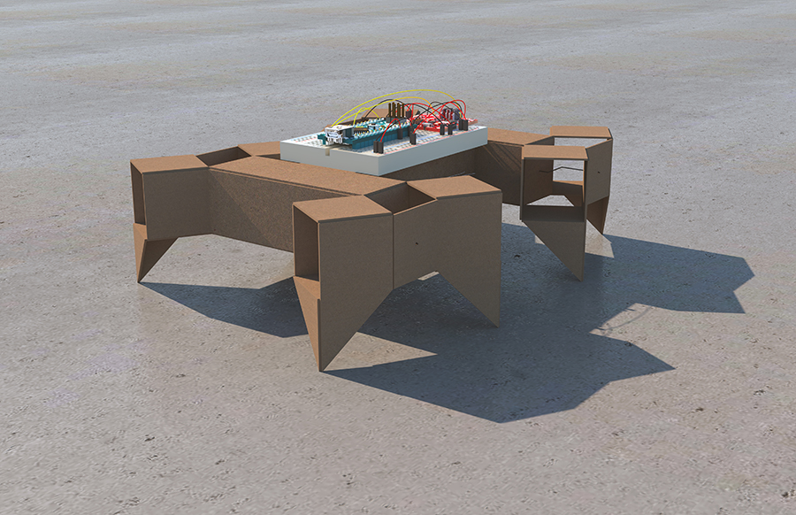
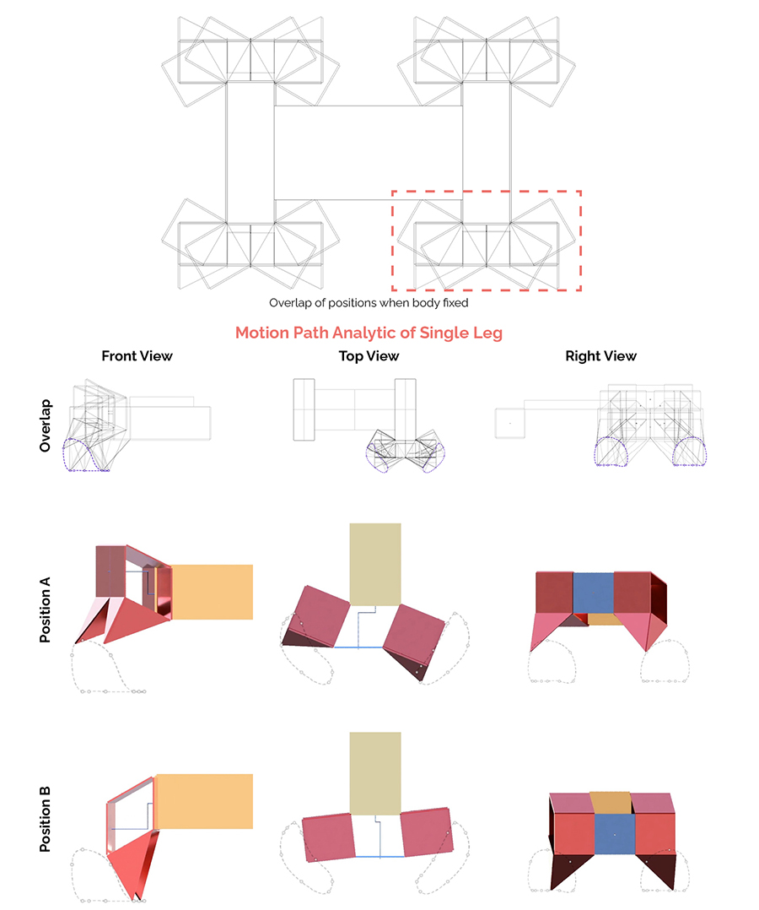

> Modify date: 2021-01-02

# Basic Info

head1 | head2
--- | ---
Subtitle | Bio-Inspried Robotics Design 
Category | Professional Work from GSD SCI-6478 Informal Robotics, New Paradigms for Design & Construction 
Date | Feb - May, 2020 
Tutor | Chuck Hoberman 
Collaborator | Beko Liu 

This is the final project of the course SCI-6478, meant to be a synthesis of work in kinematics, fabrication, controls and application.

In the early stage, the concept was developed through the mimic of millipede with modular segments. The concept was carried on by several rounds of fabrication tests. In the later stage, due to the remote-learning policy, the project was tested via Autodesk Fusion 360. In the finishing stage, the robotic was consist of two pairs of legs. The direction of rotation determined its direction of motion, and the speed of rotation determined its steering system.

<iframe width="900" height="500" src="https://www.youtube.com/embed/WKQ_OYwcwu4" frameborder="0" allow="accelerometer; autoplay; clipboard-write; encrypted-media; gyroscope; picture-in-picture" allowfullscreen></iframe>

---

# Evolution

## Stage I

In Stage I, the design was inspired by insect like millipede - each group of 6 connected cubes represented a modular segment in the body. The pattern had total freedom in all degrees, making it possible for multiple motions and even for infinite fabrication space between segments.

## Stage II

In Stage II, the horizontal degree of freedom heading the main direction of moving forward was eliminated. The location and transmission modes of motors were considered in this stage. It was determined that each segment would be driven by one motor, and that a typical pattern with 2 segments will be studied.

## Stage III

In Stage III, 2 degrees of freedom were remained and the motion of climbing was eliminated. The motors were relocated in the central cube, each driving a pair of legs. The usage of degrees of freedom and the way of transmission from the motors were redesigned to present a more convincing motion.

## Stage IV

In Stage IV, the joint in legs was modified from cylinder joint to rotate joint based on the motion in stage III. Different locations of the motors were tested.

---

# Typical Positions

---

# Motion Path

## Right View

<video width="600" controls autoplay src="../../assets/img/00architecture/09informalrobotics/motionpathvideo/single-front-path.mp4"></video>

## Top View

<video width="600" controls autoplay src="../../assets/img/00architecture/09informalrobotics/motionpathvideo/single-plan-path.mp4"></video>

## Front View

<video width="600" controls autoplay src="../../assets/img/00architecture/09informalrobotics/motionpathvideo/single-right-path.mp4"></video>

## Motion Animation

<video width="600" controls autoplay src="../../assets/img/00architecture/09informalrobotics/realistic.mp4"></video>

---

