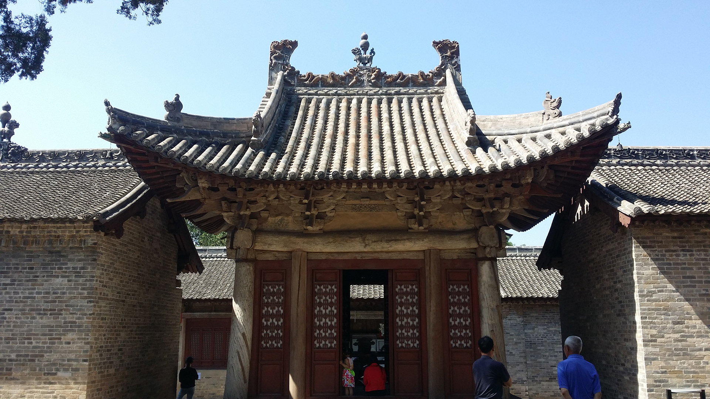
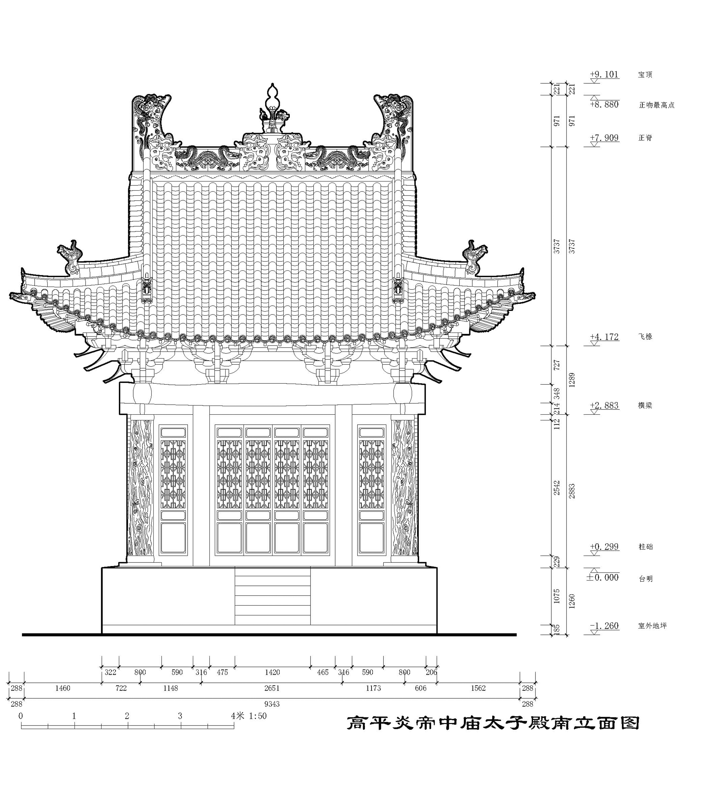
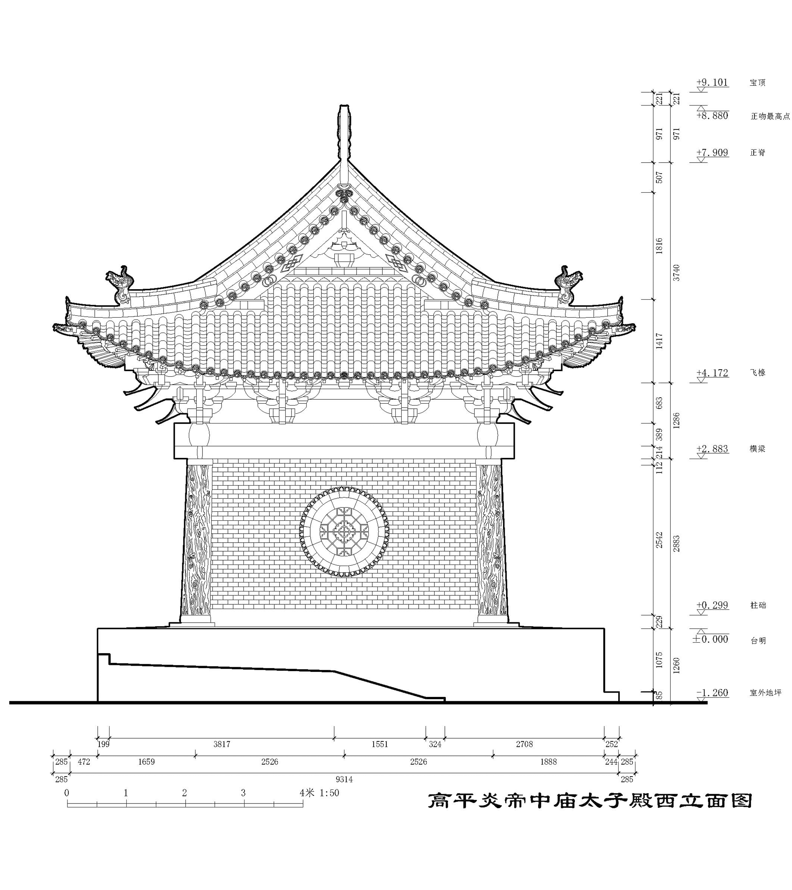
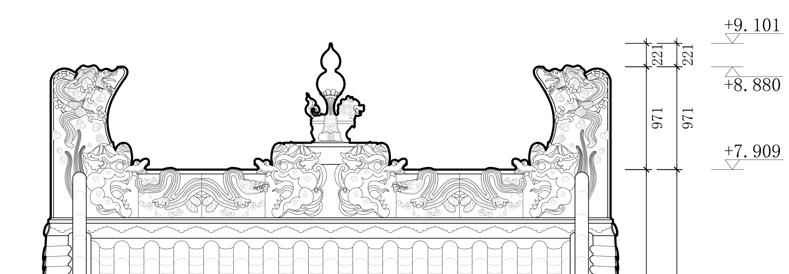

> Modify date: 2020-11-12

# Intro

* Shanxi, China
* JULY 2017
* Architectural Mapping & Drawing

*Yan Emperor Temple* lies in Gaoping, Shanxi Province. It was repaired as early as *Yuan Dynasty* according to textual research, while the year it was build is not clear.

The group of temples are typical Chinese traditional sacrificial buildings.

I was required to finish the measruement with a partner and draw detailed evelations by myself. Here is some pieces of my entire work.

---

# Mapping

---