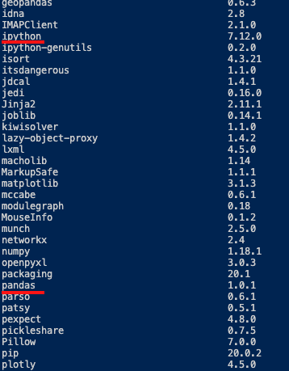

> Modify date: 2020-02-16

# Question

I installed pandas and IPython with the command

`sudo pip3 install pandas / IPython`

The modules are in the list with the command

`pip3 list`



<!--more-->

However, when debugged in VSCode

```python
import IPython
```

there is the error of

`ModuleNotFoundError: No module named 'IPython'`

# Solution

When installing the modules, use the command

`sudo -H python -m pip install pandas / IPython`

---