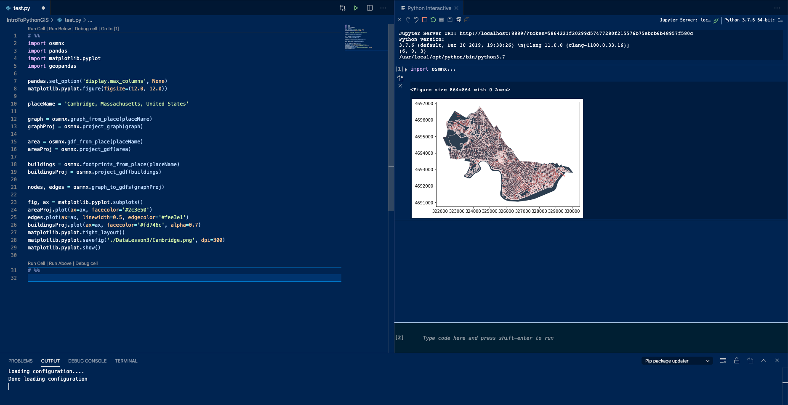

> Modify date: 2020-02-22

# Usage

## Start Jupyter in VSCode


<!--more-->

Add `#%%` to the first line of py file. The **Run Cell**, **Run Below**, and **Debug Cell** function will be added to VSCode.

**Example**

```python
# %%
import osmnx
import pandas
import matplotlib.pyplot
import geopandas
```

## Python Interactive

Use **Shift + Enter** or command **Run Cell** to start Python Interactive.



---

# Problem in Setting

Python Interactive shows error of **Jupyter Server: Unconnected**.

## Solution

Install module of **notebook**

```python
sudo pip3 install notebook
```

---