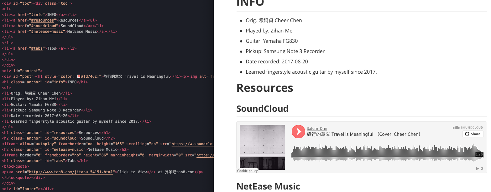

> Modify date: 2020-04-12

我的网站文章是用markdown写的，我原始的构想是用markdown自动生成HTML页面并插入到模板HTML中，同时把文章标题、时间等信息自动加入到导航页中。但是由于没有使用jekyll之类的框架，在试图转换的时候发现这是一个后端到前端的问题，用简单的JavaScript不太好解决。查询之下，发现基本要使用PHP或者Node.js来实现。本着不到万不得已不消耗过多学习成本的原则，既然是后端的自动化，为什么不用Python来实现呢？

# 目标

将markdown转化为HTML，并置入到相应的模板HTML文件中。在转换时处理YAML并且修改一些不兼容的细节。

---

# 使用的模块

* 转换相关：markdown, bs4, frontmatter
* 其他：os, re

---

# 转换的源文件和目标文件

## \*\*\*\*.md

源文件，识别YAML信息，转换成HTML并修改相应的细节；

## layout.html

模板文件，将转换并修改后的HTML代码插入其中，并修改标题等信息；

## content.html

目录页面，完成转换后将生成页面的基本信息组合成一个块级元素并插入目录顶端。

---

# 要点

## 目录结构

Markdown文件夹和生成的HTML文件夹拥有相同的目录结构，并且在转换前检查文件并自动跳过之前已转换的文件。

## YAML

检查Markdown文档的YAML，并识别相应的要素名称以便在最后的HTML文件中使用。

```YAML
title: 其他摘录
modify date: 2020-01-29
tags: [Digest, Classical Chinese Literature]
head image: /assets/img/covers/codingcover.jpg
```

## tables, toc, code

转换Markdown文件时应用tables, toc, code的转换，其中表格部分在后面修改细节，toc部分和正文部分分别插入模板文件的不同位置，code部分配合模板文件引用的highlight.js完成渲染。

```python
import markdown

class convertMDPost():

    def __init__(self, mdstr):
        self.mdstr = mdstr

    def convertALL(self, extensions=['toc', 'tables','fenced_code']):
        MDMethod = markdown.Markdown(extensions=extensions)
        self.bodyHTML = MDMethod.convert(self.mdstr)
        self.bodyTOC = MDMethod.toc
```

## <h\>

给每个层级的<h\>标签加上class="anchor"。因为我的网页有固定标题栏的存在，所以在点击table of contents的各级标题的时候，网页滚动后标题停留的位置被固定标题栏挡住，为此，我的解决方法是对每个h.anchor的标签应用padding-top样式。

```python
self.headList = self.soup.findAll(re.compile('^h\d'))
```

## table标题行

修改tables标题行。因为在我的文章里出现没有标题行的表格，但是在大多数Markdown编辑器中，没有标题行的表格是不能正确渲染的。为了在编辑的时候更直观，我给没有标题行的表格增加了一个任意字段的标题行。根据需求在转换的时候选择标题行的去留。配合css给table增加empty-cells样式。

## 图片路径

注意到Markdown文件和HTML文件中图片的相对路径可能不同。可以在Markdown编辑的时候直接使用HTML文件中的图片路径，但是存在编辑时无法预览的问题，因此选择在转换时修改img标签的相对路径。

> Path in Markdown

```markdown

```

> Path in HTML

```html
<p></p>
```

## 插入模板

将转换并修改后的HTML正文插入到模板HTML的post块级元素中，将转换得到的toc插入到模板HTML的toc块级元素中，修改模板HTML的标题和顶端背景图片。

## 正文标题

为HTML正文添加一个标题。

```python
def insertTitleInArticle(self, titletxt):
    titletag = self.soup.new_tag('h1', style="color: #fd746c;")
    titletag.string = titletxt
    addingTag = self.soup.find(id='post')
    addingTag.insert(0, titletag)
```

---

# 效果预览

## HTML与Markdown



## 网页效果


---

# 下一步

* YAML信息抓取时的容错能力，例如"title"和"Title"，以及不存在的要素名称。
* 根据YAML信息要素生成块级元素插入到目录页面中，其中的重点是摘要文字的生成。

---