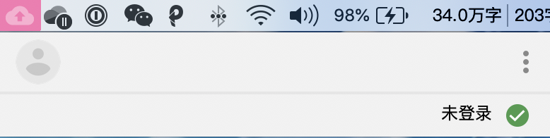
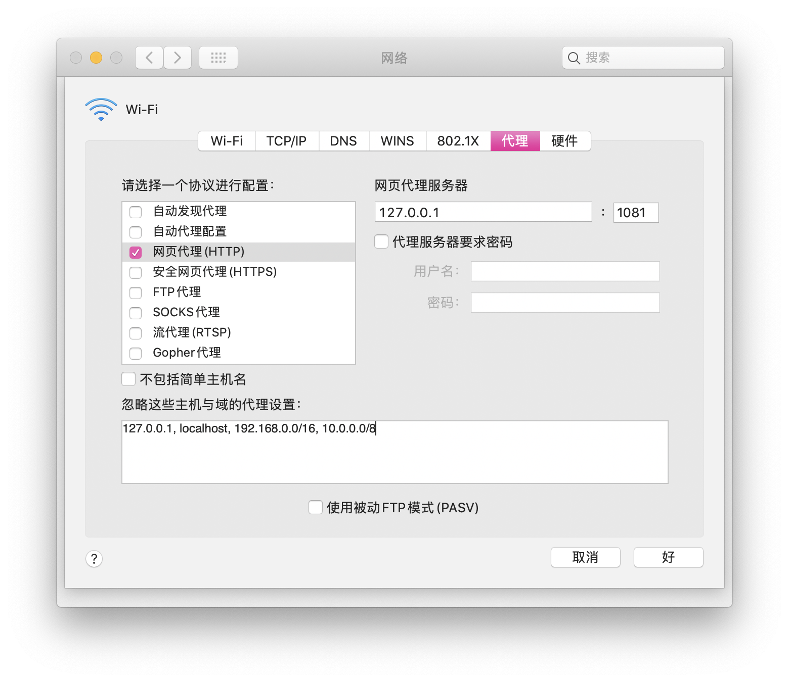

> Modify Date: 2020-05-20

# 问题发现

暑假回国，发现使用~~某种方式~~上网的过程中，Mac的Google备份与同步应用无法登录并完成同步。

如图所示，在Google等网站连接正常的情况下，Mac的Google备份与同步应用显示“未登录”或“无法连接”。目前我用了另一种~~某种上网方式~~客户端，之前使用的是$$，解决方法一样。

---

# 解决方法

## 1 - 打开~~该上网方式~~的偏好设置

在高级设置项中记录Socks5监听地址和端口。

在HTTP设置栏中记录HTTP代理监听地址和端口。

在网络接口设置栏中记录忽略这些主机与域的代理设置。

## 2 - 更改系统偏好设置中的网络偏好设置

选择网络偏好设置的高级选项。默认配置如下。

### i. 勾掉自动代理配置

### ii. 勾选网页代理(HTTP)

填写之前记录的HTTP配置。

此时重启Google备份与同步应用，应当能成功同步。

### iii. 勾选SOCKS代理

注意到由于取消了自动代理配置，Google等网站已经无法访问，所以需要配置SOCKS代理。

完成这一步之后Google等网站也已经可以正常访问。

### iv. 国内网站访问问题

注意到更改这些配置之后，国内网站也走了代理（虽然客户端设置是PAC模式）。此时需要在前两个设置（HTTP和SOCKS代理）的**忽略这些主机与域的代理设置**一栏中分别加入在客户端的网络接口设置中记录下的忽略的代理设置。

---

# 后续发现

注意到，当Google备份与同步应用在网络环境配置完成并成功连接之后，即使把网络偏好设置高级选项中的代理设置改回自动代理配置，应用也能继续备份同步。

---