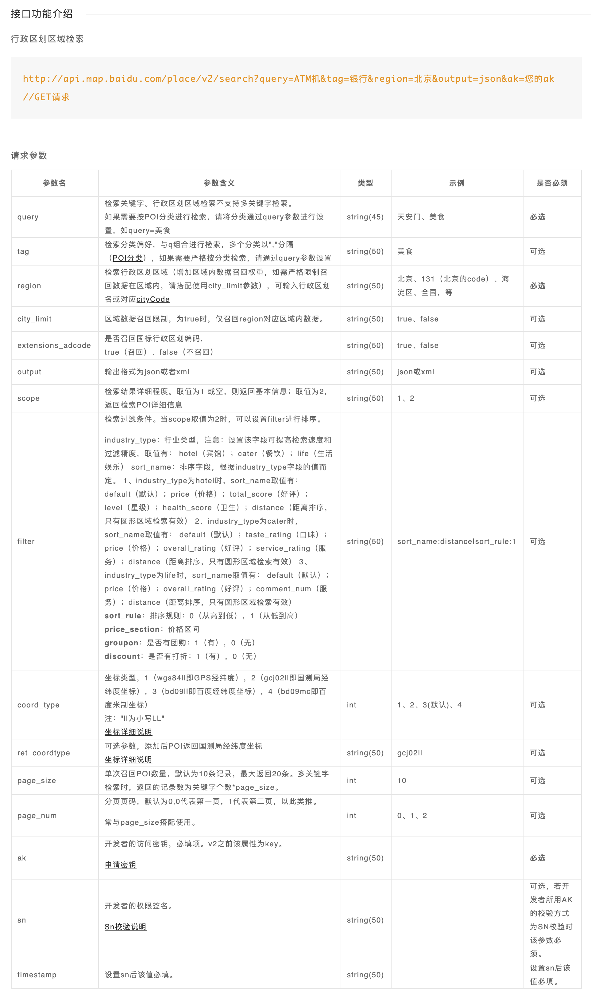
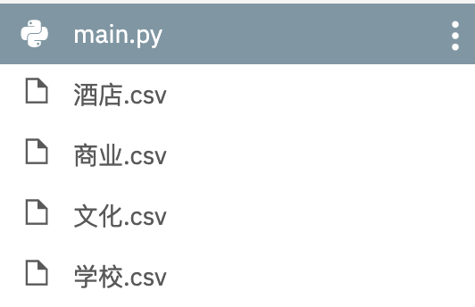
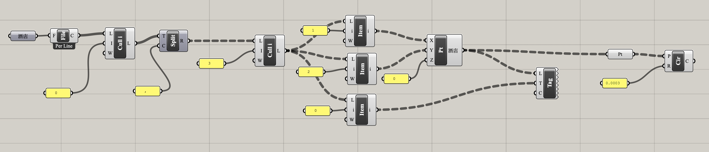
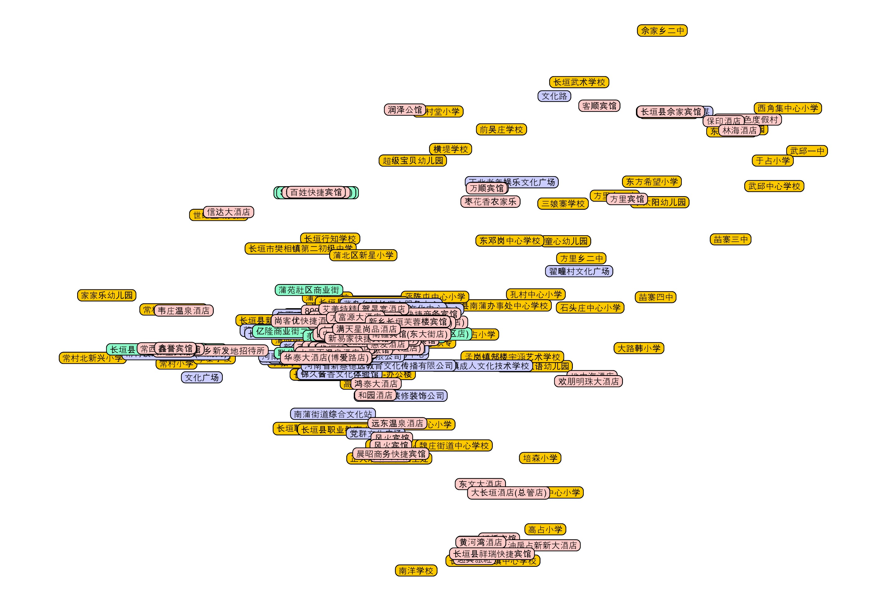

> Modify Date: 2020-06-23

# 1. 问题提出

实习期间接到一项任务：在地图上标出城市范围内的商业、文化、酒店、学校建筑，并挑选重点建筑研究其规模、业态。

针对第一个要求，在国外的时候我会直接用 **Open Street Map** 导出 `osm` 文件，拖到 **Grasshopper** 里用 **ELK** 插件鼓捣一下，直接生成。但是在国内使用 **Open Street Map** 我发现了2个问题：

* Open Street Map 上中国的建筑轮廓大量缺失；
* 没有缺失轮廓的建筑图形几乎没有任何包括用地性质在内的属性，唯一的属性就是`闭合路径/矩形`。

在此情况下我不得不考虑用 **Python** 结合百度地图的接口爬取相应属性的建筑位置信息。

此前无论是 **Google Map** 还是**百度地图**的 API，我都嫌麻烦没有尝试过，这次可以说不得不尝试一下了。同时在阅读百度地图开发者文档的时候我注意到建筑数据还带有价格、评分等属性，部分可作为这次任务第二步的参考。

思路如下：

1. **数据爬取：**利用百度地图 API 爬取该城市中某一类别的所有建筑；
2. **数据整理：**把需要的信息整理成字典，写入`csv`文件；
3. **模型生成：**用 **Grasshopper** 读取`csv`文件，处理数据，生成点；
4. **模型调整：**把经纬度转换成**地图**或者已有的 **CAD** 采用的坐标系。

---

# 2. 数据爬取

## a. 百度地图 API

### 应用 AK 获取

前往 **[百度地图开放平台](https://lbsyun.baidu.com/)** 申请 API 权限。创建应用并记住 ak 代码。

### 地点检索请求参数文档

前往 **[百度地图 API SDK 地点检索部分](https://lbsyun.baidu.com/index.php?title=webapi/guide/webservice-placeapi)** 页面查询请求参数。



### 坐标转换服务

前往 **[百度地图 API SDK 坐标转换](https://lbsyun.baidu.com/index.php?title=webapi/guide/changeposition)** 部分查询转换参数。本来预计要用，由于时间紧张，最后没用上。

## b. Python 代码部分

```python
import requests
import csv
import time
import codecs


# 搜索某地区某种属性（商业/文化/酒店/学校）建筑的数据，返回一个处理后的字典列表
def searchBaidumap(keyword, region, pageIndex):
    url = 'http://api.map.baidu.com/place/v2/search'
    ak = '*****************'# 自己创建的项目 ak 参数

    finalData = []

    params = {
        "query": keyword,# 建筑属性
        "output": "json",
        "ak": ak,
        "region": region,
        "page_size": 20,# 检索每页结果数（最大20）
        "page_num": pageIndex,# 检索页码编号
        "scope": 2,
        "coord_type": 4# 目标的CAD坐标不明，尝试了多种坐标系均不符合
    }

    response = requests.get(url, params)
    result = response.json()
    status = result.get("status")
    message = result.get("message")# 服务状态码见 SDK 文档

    if status != 0 and status != 2:
        raise Exception(message)

    data = result['results']

    # 我只需要经纬度、名称、地址
    for adr in data:
        singleDict = {'name': '', 'lng': '', 'lat': '', 'address': ''}
        singleDict['name'] = adr['name']
        location = adr['location']
        singleDict['lng'] = float(location['lng'])
        singleDict['lat'] = float(location['lat'])
        singleDict['address'] = adr['address']
        finalData.append(singleDict)

    return finalData


# 将结果输出为以相应属性命名的本地 csv 文件
def saveCSV(data, fileName):
    csv_columns = data[0].keys()
    csv_file = '%s.csv' % fileName
    try:
        with codecs.open(csv_file, 'w', 'utf_8_sig') as csvfileopened:# codecs 模块防止保存到本地的文件显示乱码
            writer = csv.DictWriter(csvfileopened, fieldnames=csv_columns)# csv 模块直接写入 csv 表头和之后的每一行
            writer.writeheader()
            for singleDataSet in data:
                writer.writerow(singleDataSet)
    except IOError:
        print('I/O error')
    print('%s抓取结果已保存到%s' % (fileName, csv_file))


data = []
pageIndex = 0
keyword = '文化'# 依次为商业/文化/酒店/学校

# 爬取每一页的20个结果，直到最后一页结果数小于20
while (True):
    singlePageData = searchBaidumap(keyword, '**', pageIndex)# 相关城市名称
    data.extend(singlePageData)# list.append() 和 list.extend() 的区别
    print('第%d页已抓取' % (pageIndex + 1))
    if (len(singlePageData) < 20):
        break
    pageIndex += 1
    time.sleep(0.5)

print('%s类别下共抓取到%d条信息' % (keyword, len(data)))

saveCSV(data, keyword)

```

## c. 运行结果

### console

```python
第1页已抓取
第2页已抓取
第3页已抓取
文化类别下共抓取到56条信息
文化抓取结果已保存到文化.csv
```

### 文件目录



### csv 文件内容

```
name,lng,lat,address
中国烹饪文化博物馆,114.665989,35.185874,博爱路与新长北线交叉口
拉菲文化传媒,114.662922,35.192147,河南省新乡市长垣市欧洲小镇131
文化路,114.802848,35.346359,河南省新乡市长垣县
......
```

---

# 3. 模型处理

## a. Grasshopper 电池图

### 整体电池图


### 处理思路

1. 直接把 csv 文件丢给电池`read file`，文件每一行的所有数据会变成一整个`string`，得到一个列表。
2. 去头后，用`text split`电池截取一下，得到树形数据。
3. 将这些数据的第1，2项取出来作为 x, y 坐标，加上0作为 z 坐标，创建点并 bake 到相应图层；取这些数据的第0项，用`text tag`电池显示并作为`text dot`对象 bake 到相应图层和相应的点上。
4. 最后每个点生成一个`circle`是为了方便后续与 CAD 和 Ai 交互，在 Rhino 内处理数据时非必须。



### 运行结果



## b. Rhino 模型调整

### ConvertDots

`text dot`对象导出到 dwg 或 ai 文件都不显示，因此在 Rhino 中用`ConvertDots`指令转换成`text`对象。

### 坐标调整

没时间了，直接找了4个较远的点，把 Google Map 截图插入，拉伸一下就完事儿了。没有精确转换。

---

# 4. 总结

## a. 时间进度

* 在公司总有其他任务追着，没有太多时间仔细修代码，而且爬出来的数据只是第一步，最重要的是后面大量的业态规模、产业特点的分析。
* 前面爬到数据花了10分钟，得到了看起来非常酷的一系列数据。但是后面修正代码，直到能完成数据整理和写入的步骤，花了较长时间，更不用说在和 **Grasshopper** 交互上用的时间。
* 作为整个项目分析的第一步，其实这个数据获取的过程从10分钟之后开始就有一些收支不平衡了。<s>不过谁让我是实习生呢，划一划。</s>
## b. 步骤任务分配

* 写代码的时候纠结的点大多是“用 Python 导出什么程度的数据给 Grasshopper？”一开始直接把原始数据导出了，但是在 Grasshopper 处理过程中我甚至要用到 **GhPython** 编辑数据，后者的语法和正常的 Python 有些许差异，在时间紧张的情况下很难完成。
* 最后我选择了在爬取的时候处理好数据，只保存最重要的几项，然后在 **Grasshopper** 里用电池图简单生成一下。
## c. 未能达成的预期

* 时间紧张，安排不妥。
* 短时间内，坐标转换没有完美。
* 后面的数据分析没有触及。

## d. 其他

* 公司的电脑不能安装编译器，我又使用了 [repl.it](https://repl.it/) 在线编译，这次顺利导入模块，直接在云端完美运行了。体验甚佳。我记得2年前好像不能导入很多模块来着。

---