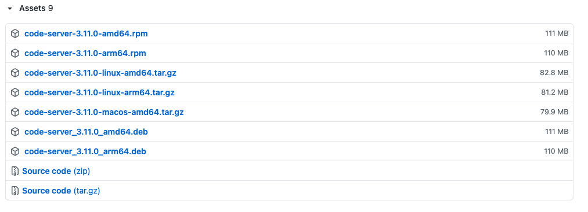
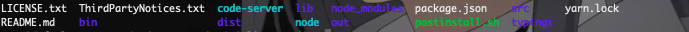

> Modify Date: 2021-07-22

# 问题提出

近日某好友在使用 python 实时获取美股信息的时候遇到网络无法连接和上班摸鱼不容易的问题，导致损失惨重。遂想起我有一海外服务器，必然无障碍，提出了让服务器定期跑脚本的设想。在简单研究之后，我提出一点改进意见，抛弃 ssh，直接用 [code-server](https://github.com/cdr/code-server) 在网页端搭建一个图形界面的 VS Code，供他在公司电脑上直接实时运行和编辑。

---

# 操作步骤

以下操作均在 **Ubuntu 20.04** Command Line 中进行。

1. 下载安装 code-server
2. 试运行并修改配置
3. 借助 Nginx 设置反向代理和二级域名
4. 域名加密


---

# 下载安装 code-server

[code-server](https://github.com/cdr/code-server) 在 GitHub 上已经发布到 3.11.0。在右侧点击 [Releases](https://github.com/cdr/code-server/releases) 找到对应自己系统的版本并拷贝链接地址。



在服务器根目录下执行代码

```sh
# 下载相应的文件，链接地址选择符合自己系统要求的版本
wget https://github.com/cdr/code-server/releases/download/v3.11.0/code-server-3.11.0-linux-amd64.tar.gz
# 解压缩，xxx代表下载下来的文件名称
tar -xzvf [xxx]
# 查看一下解压出来的内容，xxx代表解压出来的文件夹名称
cd [xxx]
ls
```



---

# 试运行并修改配置

注意到 `code-server` 即可执行文件，尝试执行

```sh
./code-server
# Ctrl + C 停止程序
```


可以看到，程序在监听 http://127.0.0.1:8080 也即本地的8080端口，并且密码等设置存储在 `~/.config/code-server/config.yaml` 文件内。

## IP + 端口直接访问

此时有一种最直接的操作，改变程序监听地址（0.0.0.0代表任何 IP）

```sh
# 使用 --host0.0.0.0 把程序暴露在外网
./code-server --host 0.0.0.0
```

此时到浏览器地址栏中输入服务器 IP:8080，可以看到这个界面


到 `~/.config/code-server/config.yaml` 找到密码，即可登录 code-server 服务器。

---

# 借助 Nginx 设置反向代理和二级域名

输入 IP + 端口的方式很不优雅，希望能改成直接用域名访问，就像正常网站一样。

由于服务器内有 Nginx 还有绑定域名，考虑给这个服务分配一个二级域名并且用 Nginx 实现端口反代，就能达成这个要求。

## 更改 code-server 配置

```sh
nano ~/.config/code-server/config.yaml
```

```yaml
bind-addr: 127.0.0.1:8080
auth: password
password: [xxx] # xxx为可自定义的密码
cert: false
```

为了避免后面每次运行都输入 `--host` 之类的，在配置中可以直接调好。

## 二级域名指向

在域名提供商的后台添加 A Record 记录


## 配置 Nginx 反向代理

* 新建一个配置文件

```sh
nano /etc/nginx/sites-available/code-server.conf
```

* 输入配置

```nginx
server {
    listen 80;
    listen [::]:80;

    server_name [xxx]; # xxx为自己的二级域名

    location / {
    		# 这一句实现端口反向代理
        proxy_pass http://localhost:8080/; # 更改为自己配置中开放的端口
        proxy_set_header Upgrade $http_upgrade;
        proxy_set_header Connection upgrade;
        proxy_set_header Accept-Encoding gzip;
    }
}
```

Ctrl + O Write out, Ctrl + X Close.

* 把配置文件添加到 sites-enabled 文件夹中

```sh
ln -s /etc/nginx/sites-available/code-server.conf /etc/nginx/sites-enabled/code-server.conf
```

* 检查并重启 Nginx 服务

```sh
nginx -t
nginx -s reload
```

---

# 域名加密

域名的加密我用的是 [certbot](https://certbot.eff.org/)。根据系统和软件选择相应的组合，傻瓜式一键配置。因为我之前已经配置过其他域名，所以直接执行

```sh
certbot --nginx
```

此时启动程序

```sh
./code-server # 需要更改为实际的文件路径
```

在浏览器直接输入前面绑定的二级域名，就可以看到网站已经加密，并且显示密码登录的界面，输入密码，就可以直接进入熟悉的 VS Code 界面，开始编辑。


---

# 注意事项和下一步

1. 这玩意儿挺吃内存的，1G 的内存从 19% 的占用直接到 50+%。
2. 要配置二级域名的反向代理，前提是顶级域名也指向这台服务器。我之前顶级域名一直指向 GitHub Pages，这次为了配置 code-server，把顶级域名也转移过来了。
3. 下一步可能考虑把 code-server 绑定到系统进程里，这样可以实现开机自动启动，和手动关闭（现在一旦 ssh 失去连接，很难关闭）。

---
