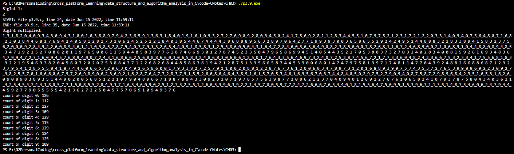

> Modify Date: 2022-06-16

# 问题描述

3.9. 编写任意精度整数运算包。要使用类似于多项式运算的方法。计算在 $2^{4000}$ 内数字 0 到 9 的分布。

3.9. Write an arbitrary-precision integer arithmetic package. You should use a strategy similar to polynomial arithmetic. Compute the distribution of the digits 0 to 9 in $2^{4000}$.

随书没有附本题答案，网上几乎没搜到相关解答，仅有的一些解答也存在问题。刚好自己写一版。

---

# 思考要点

1. 题 3.4-3.8，已经逐步实现了单链表表示多项式，并执行了多项式加法，3 种思路的多项式乘法，和多项式幂运算。在此基础上，根据提示，把任何精度十进制本质上可以看成 10 的不同次幂的多项式，即可用现成的算法执行整数运算。

2. $2^{4000}$ 最直接的方法就是把 $2\times10^0$ 循环乘 4000 次。二分法可以减少时间复杂度，按下不表。

3. 需要注意的是进位，在运算中直接进位是最好的，但是为了基本照抄前面的算法，我在每次运算完成后才进位。

4. 解决进位时前一项指针的记录问题的方法有，

   1. 编写 FindPrevious 函数，时间复杂度较大；
   2. 改成链表从小到大记录，简单直接，但是若在题目要求之外需要从大到小打印，可能存在递归栈溢出的风险；
   3. 将单链表改成双链表。

   这里采用第三种。

---

# 算法实现

## big_integer.h

```c
#include <stdio.h>
#include <stdlib.h>
#include <stdbool.h>

#ifndef _Big_integer_H

struct Node;
typedef struct Node *PtrToNode;
typedef PtrToNode BigInt;
typedef PtrToNode Position;

int IsLast(Position P, BigInt BI);
void Insert(int c, int e, BigInt BI, Position P);
void PrintBigInt(BigInt BI);
void BigIntConstructor(int *C, int *E, int N, BigInt BI);
BigInt BigIntAdd(BigInt BI1, BigInt BI2);
BigInt BigIntMulti(BigInt BI1, BigInt BI2);
void FormatBigInt(BigInt BI);
void CountDigits(BigInt BI, int *counts, int n_digits);
void DeleteBigInt(BigInt BI);

#endif

struct Node
{
    int Coefficient;
    int Exponent;
    PtrToNode Previous;
    PtrToNode Next;
};

int IsLast(Position P, BigInt BI)
{
    return P->Next == NULL;
}

void Insert(int c, int e, BigInt BI, Position P)
{
    Position tmp;
    tmp = (Position)malloc(sizeof(struct Node));
    if (tmp == NULL)
    {
        printf("Out of space!!!");
        exit(EXIT_FAILURE);
    }
    tmp->Coefficient = c;
    tmp->Exponent = e;
    tmp->Next = P->Next;
    tmp->Previous = P;

    P->Next = tmp;
    if (!IsLast(tmp, BI))
        tmp->Next->Previous = tmp;
}

void PrintBigInt(BigInt BI)
{
    Position P = BI;
    if (IsLast(P, BI))
        return;

    int E = P->Next->Exponent;
    while (E >= 0 && !IsLast(P, BI))
    {
        if (P->Next->Exponent == E)
        {
            printf("%d_", P->Next->Coefficient);
            P = P->Next;
        }
        else
            printf("0_");
        E--;
    }
    printf("\n");
}

void BigIntConstructor(int *C, int *E, int N, BigInt BI)
{
    Position P = BI;
    while (!IsLast(P, BI))
        P = P->Next;

    for (int i = 0; i < N; i++)
    {
        Position tmp;
        tmp = (Position)malloc(sizeof(struct Node));
        if (tmp == NULL)
        {
            printf("Out of space!!!");
            exit(EXIT_FAILURE);
        }

        tmp->Coefficient = *(C + i);
        tmp->Exponent = *(E + i);
        tmp->Next = NULL;
        tmp->Previous = P;

        P->Next = tmp;
        P = P->Next;
    }
}

BigInt BigIntAdd(BigInt BI1, BigInt BI2)
{
    BigInt BI = (BigInt)malloc(sizeof(struct Node));
    BI->Next = NULL;

    Position P1 = BI1->Next;
    Position P2 = BI2->Next;
    Position P = BI;

    while (P1 != NULL && P2 != NULL)
    {
        if (P1->Exponent < P2->Exponent)
        {
            Insert(P2->Coefficient, P2->Exponent, BI, P);
            P2 = P2->Next;
        }
        else if (P1->Exponent > P2->Exponent)
        {
            Insert(P1->Coefficient, P1->Exponent, BI, P);
            P1 = P1->Next;
        }
        else
        {
            Insert(P1->Coefficient + P2->Coefficient, P1->Exponent, BI, P);
            P1 = P1->Next;
            P2 = P2->Next;
        }
        P = P->Next;
    }

    while (P1 != NULL)
    {
        Insert(P1->Coefficient, P1->Exponent, BI, P);
        P1 = P1->Next;
        P = P->Next;
    }

    while (P2 != NULL)
    {
        Insert(P2->Coefficient, P2->Exponent, BI, P);
        P2 = P2->Next;
        P = P->Next;
    }

    return BI;
}

BigInt BigIntMulti(BigInt BI1, BigInt BI2)
{
    BigInt BI = (BigInt)malloc(sizeof(struct Node));
    BI->Next = NULL;

    Position P1 = BI1->Next;
    Position P2 = BI2->Next;

    while (P1 != NULL)
    {
        BigInt TMP = (BigInt)malloc(sizeof(struct Node));
        TMP->Next = NULL;
        Position TMPP = TMP;
        BigInt BIadd = BI;

        while (P2 != NULL)
        {
            // printf("%s %d %s %s\n", __FILE__, __LINE__, __DATE__, __TIME__);
            Insert(P1->Coefficient * P2->Coefficient, P1->Exponent + P2->Exponent, TMP, TMPP);
            TMPP = TMPP->Next;
            P2 = P2->Next;
            // printf("%s %d %s %s\n", __FILE__, __LINE__, __DATE__, __TIME__);
        }

        BI = BigIntAdd(BIadd, TMP);
        P1 = P1->Next;
        P2 = BI2->Next;
        DeleteBigInt(TMP);
        DeleteBigInt(BIadd);
        FormatBigInt(BI);
    }

    return BI;
}

void FormatBigInt(BigInt BI)
{
    // go from the end of the list, carry the digits
    Position P = BI;
    while (!IsLast(P, BI))
        P = P->Next;

    // now P is the last node
    while (P->Previous != BI)
    {
        if (P->Coefficient >= 10 && P->Previous->Exponent > P->Exponent + 1)
            Insert(0, P->Exponent + 1, BI, P->Previous);
        P->Previous->Coefficient += P->Coefficient / 10;
        P->Coefficient %= 10;
        P = P->Previous;
    }

    // deal with the first digit
    if (P->Coefficient >= 10)
    {
        Insert(0, P->Exponent + 1, BI, P->Previous);
        P->Previous->Coefficient += P->Coefficient / 10;
        P->Coefficient %= 10;
    }
}

void CountDigits(BigInt BI, int *counts, int n_digits)
{
    Position P = BI->Next;
    while (P != NULL)
    {
        *(counts + P->Coefficient) += 1;
        P = P->Next;
    }
}

void DeleteBigInt(BigInt BI)
{
    Position P, tmp;
    P = BI->Next;
    BI->Next = NULL;
    while (P != NULL)
    {
        tmp = P->Next;
        free(P);
        P = tmp;
    }
}

```

## p3.9.c

```c
#include <stdio.h>
#include <stdlib.h>
#include "big_integer.h"


int main(void)
{
    // bi1 = 2*10^0, const
    BigInt bi1 = malloc(sizeof(struct Node));
    bi1->Next = NULL;

    BigInt bires = malloc(sizeof(struct Node));
    bires->Next = NULL;

    int bi1_c[1] = {2};
    int bi1_e[1] = {0};

    BigIntConstructor(bi1_c, bi1_e, 1, bi1);
    BigIntConstructor(bi1_c, bi1_e, 1, bires);

    printf("BigInt 1:\n");
    PrintBigInt(bi1);

    printf("START: file %s, line %d, date %s, time %s\n", __FILE__, __LINE__, __DATE__, __TIME__);

    int cnt = 1;
    while (cnt < 4000)
    {
        BigInt bitmp = bires;
        bires = BigIntMulti(bi1, bitmp);
        DeleteBigInt(bitmp);
        cnt++;
    }

    printf("END: file %s, line %d, date %s, time %s\n", __FILE__, __LINE__, __DATE__, __TIME__);

    printf("BigInt multiplied:\n");
    PrintBigInt(bires);

    int digit_counts[10] = {0};
    int n_digits = 10;

    CountDigits(bires, digit_counts, n_digits);
    for (int i = 0; i < 10; i++)
        printf("count of digit %d: %d\n", i, digit_counts[i]);

    DeleteBigInt(bi1);
    DeleteBigInt(bires);

    return 0;
}


```

---

# 运行结果



---

# 代码链接

[GitHub](https://github.com/saturn-drm/ZMEI_MOE_blog_code/tree/main/Arbitrary-Precision%20Integer)

