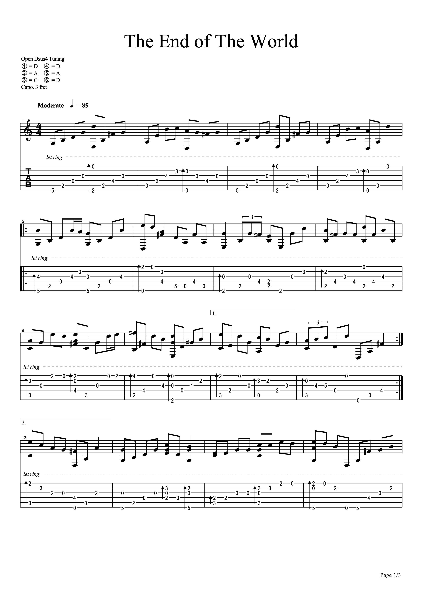
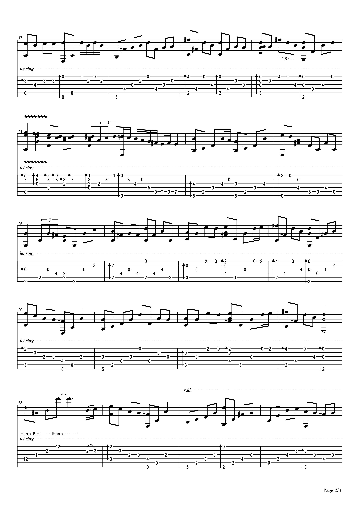
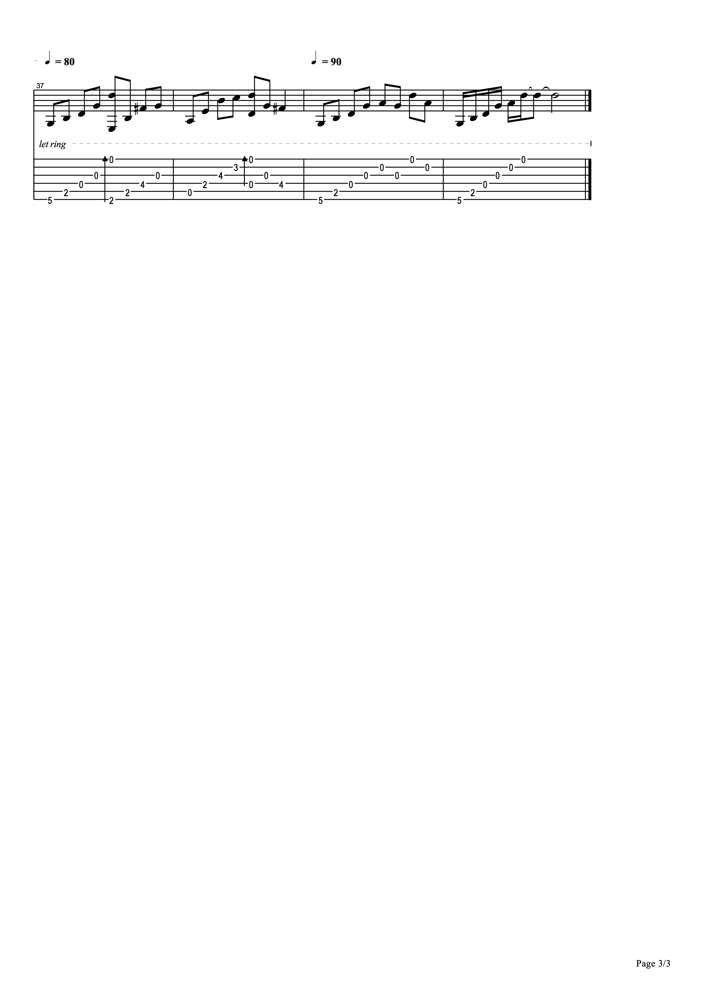

# INFO
* Orig. 岸部眞明 (Masaaki Kishibe)
<!--more-->
* Played by: Zihan Mei
* Guitar: Yamaha FG830
* Pickup: Samsung Note 3 Recorder
* Date recorded: 2018-11-11
* Learned fingerstyle acoustic guitar by myself since 2017.

# Resources
## SoundCloud
<iframe width="100%" height="166" scrolling="no" frameborder="no" allow="autoplay" src="https://w.soundcloud.com/player/?url=https%3A//api.soundcloud.com/tracks/741229780&color=%23fd746c&auto_play=false&hide_related=false&show_comments=true&show_user=true&show_reposts=false&show_teaser=true"></iframe>

## NetEase Music
<iframe frameborder="no" border="0" marginwidth="0" marginheight="0" width=420 height=86 src="//music.163.com/outchain/player?type=3&id=2057731861&auto=0&height=66"></iframe>

# Tabs
## Image Tabs
### Page 01

### Page 02

### Page 03

## PDF Tabs

[Click to Download](/assets/img/02literature/00guitar/2018-11-11theendoftheworld/TheEndofTheWorld.pdf)
